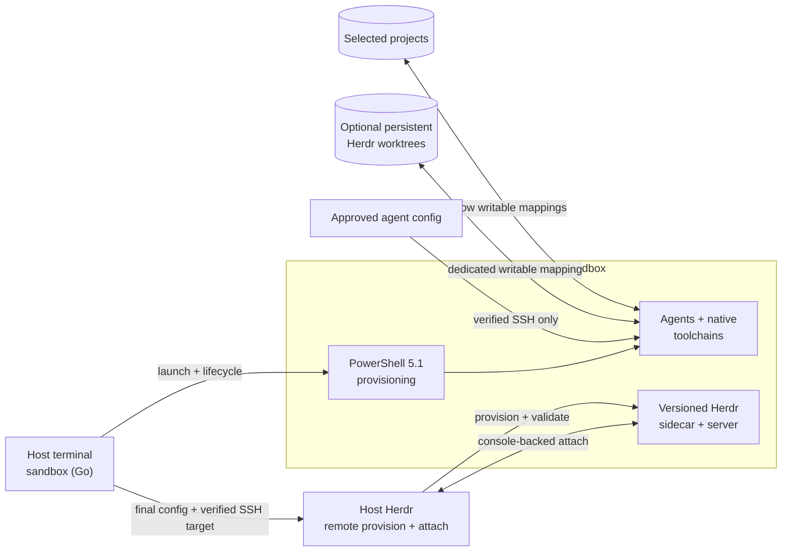

# Herdr Sandbox

**Run coding agents in a disposable, native Windows development environment without RDP, broad home-directory mounts, or host toolchain drift.**

[](https://github.com/hdosys/herdr-sandbox/actions/workflows/nightly.yml) [](https://github.com/hdosys/herdr-sandbox/actions/workflows/release.yml) [](go.mod)  [](LICENSE)

Herdr Sandbox is a Windows-native counterpart to a [dev container](https://containers.dev/). Run `sandbox up` from a project and continue working in the normal host terminal while coding agents and native Windows toolchains run inside Windows Sandbox. Selected source folders remain on the host; guest tools and processes disappear when the Sandbox closes.

[Value](#what-you-get) · [Engineering](#engineering-approach) · [How it works](#how-it-works) · [Get started](#get-started) · [Stacks](#supported-stacks) · [Commands](#commands) · [Configuration](#configuration) · [Security](#security-boundaries) · [Optional workflows](#optional-workflows) · [Troubleshooting](#troubleshooting)

## What you get

- **Confidence in real Windows behavior:** compile, test, package, and automate GUI applications in Windows Sandbox instead of a compatibility layer.
- **Your normal terminal:** Herdr attaches from the host, so routine work does not require RDP or a second desktop workflow.
- **Repeatable project setup:** select composable tool stacks or keep an idempotent PowerShell profile with the project.
- **Fast iteration:** reuse and reprovision a compatible ready guest instead of rebuilding it for every change.
- **Deliberate persistence:** source, an optional worktree root, approved agent configuration, and a verified package cache survive; guest tools and processes do not.
- **Explicit opt-ins:** browser automation, TradingView, audio, microphone, and experimental mobile access remain off unless selected.

## Engineering approach

- **One control plane:** standard-library-first Go owns CLI, configuration, lifecycle, SSH, cleanup, and packaging. PowerShell 5.1 is limited to Windows provisioning.
- **One owner per responsibility:** state, process identity, project profiles, installer behavior, and external integrations have explicit boundaries rather than parallel implementations.
- **Fail-closed lifecycle handling:** cancellation, bounded process trees, atomic state publication, strict parsing, and ownership checks prevent uncertain cleanup or attachment.
- **Reproducible provisioning:** versions, package identity, hashes, signatures, and realized state are checked where the external boundary supports them. Repeated runs converge without duplicating work.
- **Real release evidence:** fast tests and static checks cover the control plane; package gates compile and validate the real installer, while opt-in Windows Sandbox acceptance exercises provisioning, SSH, and attach.

## How it works



The host keeps source, identity, configuration, cache, and bounded run evidence. The guest owns compilation, agent execution, and disposable runtime state. Go makes lifecycle decisions; PowerShell performs Windows-specific provisioning.

> [!IMPORTANT]
> Windows Sandbox separates this work from the normal Windows installation, but selected projects remain writable and guest administrators can access explicitly transferred credentials. Networking is enabled. Keep backups and normal supply-chain controls; see [Security boundaries](#security-boundaries) before using untrusted code.

## Get started

### Prerequisites

- Windows 10 or Windows 11 with hardware virtualization and Windows Sandbox support.
- Windows Terminal, the Windows OpenSSH Client (`ssh.exe` on host `PATH`), and internet access for cache misses.
- The maintained [Herdr-Win](https://github.com/hdosys/herdr-win) distribution on host `PATH`.
- Go 1.26.4 or newer only when building this repository from source.

If Windows Sandbox is not enabled, run the following from elevated Windows PowerShell and restart Windows:

```powershell
Enable-WindowsOptionalFeature -Online -FeatureName Containers-DisposableClientVM -All
```

### Install Herdr-Win

Download the newest `herdr-win_v<version>_windows_amd64_setup.exe` from
[Herdr-Win releases](https://github.com/hdosys/herdr-win/releases), verify its
GitHub SHA-256 digest, run setup, and open a new terminal:

```powershell
herdr --version
```

The result must contain the exact `herdr-win` marker. Herdr-Win supplies the
Windows remote-provisioning support this project needs and remains a separate
installation.

### Install Herdr Sandbox

Choose either WinGet or the direct installer.

#### WinGet

```powershell
winget install --id hdosys.herdr-sandbox --exact --source winget
```

Upgrade later with:

```powershell
winget upgrade --id hdosys.herdr-sandbox --exact --source winget
```

#### Direct installer

Download `herdr-sandbox_<version>_windows_amd64_setup.exe` from the latest
[Herdr Sandbox release](https://github.com/hdosys/herdr-sandbox/releases/latest),
compare `Get-FileHash -Algorithm SHA256 <path>` with GitHub's digest for the same
asset, and run setup. The interactive Finish page can open the new configuration.

#### After either installation

Both paths use the same per-user installer, require no administrator access, and
add `sandbox` to user `PATH`. Open a new terminal and confirm:

```powershell
sandbox --version
```

> [!WARNING]
> The Herdr-Win and Herdr Sandbox installers are currently unsigned. WinGet
> verifies Herdr Sandbox against its community manifest. For direct downloads,
> use only the linked GitHub repositories and verify the published asset digest.

<details>
<summary><strong>Installer and uninstall behavior</strong></summary>

- Setup owns the fixed `%LOCALAPPDATA%\Programs\Herdr Sandbox` binary directory and replaces that complete directory during upgrade.
- `%APPDATA%\herdr-sandbox\config.json` and `user.ps1` are created only when absent and survive upgrades and normal uninstall. Select **Also delete config.json and user.ps1** only when that removal is intended.
- Files manually placed inside the installed binary directory are removed during upgrade or uninstall; projects, Herdr-Win, and unrelated user data remain outside installer ownership.
- Remove an older-format installation with its matching uninstaller before installing the current release. The current setup deliberately does not migrate historical installer formats.
- Uninstall from **Settings → Apps → Installed apps**. A running Windows Sandbox is preserved and becomes unmanaged rather than being closed by setup.

</details>

<details>
<summary><strong>Portable ZIP and source build</strong></summary>

#### Portable ZIP

Download `herdr-sandbox_<version>_windows_amd64.zip`, verify its GitHub SHA-256 asset digest, and extract all four files into one directory. Keep the three support files beside `sandbox.exe`, then run `.\sandbox.exe` or add that directory to user `PATH`.

#### Build from source

From the repository root:

```powershell
go run ./cmd/task verify
```

The checked build writes the same four files to `build\bin`. Use that executable directly or add the directory to user `PATH`.

</details>

### Launch your first project

From the project root, choose a stack, inspect the plan, and start:

```powershell
sandbox init --stack go
sandbox plan
sandbox up
```

Omit `--stack` for a prompt or repeat it to combine compatible entries from
[Supported stacks](#supported-stacks). `init` writes
`.herdr-sandbox\provision.ps1` without replacing an existing profile. `plan` is
read-only. `up` provisions the guest and attaches Herdr in the normal host
terminal; the visible Sandbox bootstrap console needs no input.

After detaching, the guest stays ready:

```powershell
sandbox status
sandbox attach
sandbox down
```

Use `sandbox up --no-attach` from a headless caller, then attach later from a real
terminal. Plain `ssh sandbox` remains available for diagnostics.

## Supported stacks

`sandbox init --stack` accepts the individual stack names below, the exclusive `all` selection, and separate project shortcuts.

| Selection | Guest tooling |
| --- | --- |
| `all` | Every standalone built-in: Android, Bun, Cargo Nextest, C/C++, .NET, Go, Java, Just, Node/Playwright, NSIS, Nushell, Playwright CLI, Python, Rust/MSVC, TradingView, uv, and Zig; project shortcuts remain separate |
| `android` | Android SDK command-line tools, Platform Tools/ADB, and an isolated Microsoft OpenJDK 17 |
| `cpp` | C and C++ with MSVC Build Tools and Windows 11 SDK 26100 |
| `dotnet` | .NET 10 LTS SDK |
| `go` | Go |
| `java` | Microsoft OpenJDK 25 LTS |
| `node` | Node.js LTS, Playwright, and Chromium |
| `nsis` | NSIS compiler for building Windows installers |
| `nushell` | Latest stable Nushell command-line shell |
| `playwright-cli` | Playwright CLI without a bundled browser |
| `python` | Latest stable Python |
| `rust` | Rust with MSVC Build Tools |
| `tradingview` | TradingView Desktop and TVControl, with available host TradingView login transferred into the disposable guest |
| `zig` | Zig |

Project profiles may also call direct Bun, Cargo Nextest, Just, and uv helpers.

### Project shortcuts

Project shortcuts package complex repository setups:

| Shortcut | Intended setup |
| --- | --- |
| `handy` | The current Handy Windows checkout, including Bun, Rust/MSVC, CMake, Vulkan SDK, and WebView2 |
| `herdr` | Herdr and Herdr-Win checkouts, including Python, Rust/MSVC, Zig, Bun, Cargo Nextest, Just, and Git for Windows `sh` |
| `python-ai` | Python 3.13 and uv for CPU inference, notebooks, and API-based projects |

Dependencies and application commands remain project-owned. `sandbox plan`
expands each shortcut without executing the profile.

## Commands

Command output is plain, deterministic, and redirect-safe. Results go to stdout
and errors go to stderr.

| Command | Behavior |
| --- | --- |
| `sandbox config` | Creates and opens user configuration without replacing an existing file. |
| `sandbox version` or `sandbox --version` | Prints the release and abbreviated source revision. |
| `sandbox plan` | Shows the validated plan and ready-guest differences without changing state. |
| `sandbox init [--stack NAME]...` | Creates a project profile, interactively when no stack is supplied. |
| `sandbox up [--memory-mb MB] [--timeout DURATION] [--no-attach]` | Starts or reprovisions a compatible guest and normally attaches. |
| `sandbox pull-host-config` | Fast-forwards explicitly registered configuration repositories without touching a guest. |
| `sandbox attach` | Attaches to a verified ready guest without reprovisioning. |
| `sandbox status` | Reports health, progress, diagnostics, and the next action. |
| `sandbox mobile` | Prints the mobile SSH profile and secret-free QR code. |
| `sandbox down` | Stops only the verified app-owned guest and preserves opted-in Tailscale state. |
| `sandbox clean` | Removes only proven inactive run state. |

Lifecycle commands clean only state proven inactive. Changed or uncertain state
is preserved and reported. Settings that change host mappings or the isolation
boundary require `sandbox down` before the next `up`.

## Configuration

Project profiles own per-project tools. `config.json` and `user.ps1` own global
choices. Setup never overwrites either user-owned file.

### Project profiles

`sandbox init` writes direct calls into `.herdr-sandbox\provision.ps1` so
`sandbox plan` can inspect requirements without executing project code. Advanced
profiles may call the supported functions in
[`provisioning\stacks.ps1`](provisioning/stacks.ps1) and add idempotent Windows
PowerShell 5.1 for project-specific tools. Keep application dependencies and
lockfiles in their normal project owners.

The first C/C++, Rust/MSVC, or Handy run may briefly show Microsoft Visual Studio
Installer while Herdr Sandbox prepares a verified Build Tools layout in its cache.
Nothing is installed into the host development environment.

### Global configuration

Open the user-owned configuration:

```powershell
sandbox config
```

The command creates `config.json` only when absent. Setup also refreshes a complete
`config.sample.json` reference without replacing user configuration. Global
PowerShell additions belong in `user.ps1`:

```text
%APPDATA%\herdr-sandbox\config.json
%APPDATA%\herdr-sandbox\user.ps1
```

`config.json` is strict JSON. A practical example:

```json
{
  "memoryMB": 16384,
  "workspaces": {
    "client": "E:\\Clients\\client"
  },
  "mounts": {
    "docs": {
      "path": "E:\\Shared\\docs",
      "readOnly": true
    }
  },
  "wingetPackages": {
    "remove": [],
    "add": [
      "SST.opencode",
      "Anthropic.ClaudeCode",
      "OpenAI.Codex",
      "GitHub.Copilot"
    ],
    "versions": {}
  }
}
```

Replace paths with existing folders. User-chosen keys such as `client` and `docs`
become the final guest folder names.

| Field | Meaning |
| --- | --- |
| `cacheDirectory` | Dedicated package/tool cache. Empty uses `<system-temp>\herdr-sandbox\cache`. Never point it at shared data. |
| `worktreeDirectory` | Optional dedicated root for persistent Herdr worktrees, mapped at `C:\Worktrees`. |
| `memoryMB` | Default Sandbox memory; minimum 2048. `--memory-mb` overrides one run. |
| `audio`, `audioInput` | Separate output and microphone opt-ins. Both default to `false`. |
| `tailscale` | Opts into a stable tagged Tailscale identity. |
| `mobileSSHAuthorizedKeys` | Up to eight device-owned Ed25519 public keys. Private keys never belong here. |
| `configurationSync` | Controls automatic fast-forward pulls before `up` and after `down`; both default on. |
| `codingAgentSync` | Selects configuration transfer for OpenCode, Claude Code, Codex, Copilot, and Pi. All default on. |
| `workspaces` | Named project roots mapped to `C:\Workspaces\<name>`. |
| `mounts` | Named additional folders mapped to `C:\Mounts\<name>` with explicit read-only choice. |
| `workspaceDiscovery` | Optionally selects direct child projects below one root, with exclusion patterns. |
| `wingetPackages` | Removes optional defaults, adds exact package IDs, and optionally pins versions. |

Run `sandbox plan` before `up` to review the effective configuration and resolved
tool versions. Package changes can apply to a compatible ready guest without
replacing it.

### Agent configuration sync

Configuration transfer is available for OpenCode, Claude Code, Codex, GitHub
Copilot CLI, and Pi, with every selection enabled by default. Review these choices
before the first `up`. Approved files travel over verified SSH; a Git-backed
configuration root also transfers bounded repository metadata and object history,
which may contain old secrets. Disable any root whose complete history is not safe
for the guest. Private SSH and GPG keys, conversations, logs, caches, and
machine-bound credentials stay on the host. Agent installation remains a separate
`wingetPackages.add` choice.

When enabled, registered configuration repositories fast-forward before `up` and
after `down`. Local edits are never rebased, stashed, or overwritten; divergence
and authentication failures are reported for the user to resolve.

### Mappings and optional settings

- Prefer read-only `mounts` for reference material. Writable mappings expose host
  data to every guest administrator process.
- `workspaceDiscovery` selects only direct child directories and supports explicit
  exclusion patterns. The nearest profiled project is included automatically.
- Audio output and microphone input are separate opt-ins. Changing either requires
  a fresh guest.
- Add `KhronosGroup.VulkanRT` only for the experimental vGPU-backed runtime path.
  It does not install a Vulkan SDK or host driver.

### Persistent Herdr worktrees

Set `worktreeDirectory` to an existing dedicated host folder when Herdr-created
linked checkouts should survive fresh Sandboxes. Use Herdr for their complete
lifecycle:

| Goal | Command | Result |
| --- | --- | --- |
| Create and open | `herdr worktree create --cwd "<main-checkout>" --branch "<branch>" --base "<ref>"` | Creates a linked checkout and opens its workspace. |
| Discover | `herdr worktree list --cwd "<main-checkout>" --json` | Lists checkouts and open workspace IDs. |
| Reopen | `herdr worktree open --cwd "<main-checkout>" --path "<checkout>"` | Reopens an existing checkout after a fresh Sandbox. |
| Remove | `herdr worktree remove --workspace "<workspace-id>"` | Removes the checkout but keeps its branch. |

These are guest-native linked worktrees. Keep the main workspace at the same guest
path, use Herdr rather than host Git for lifecycle operations, and remove linked
worktrees before removing their main workspace. `sandbox clean` and uninstall
preserve the dedicated root.

## Security boundaries

See [`SECURITY.md`](SECURITY.md) for vulnerability reporting, the complete threat
model, and practical guidance for credential-free or externally network-restricted
use.

Guest processes have administrator access inside Windows Sandbox. Only select host folders deliberately, prefer read-only mounts, and treat every credential copied into the network-enabled guest as accessible to its workloads.

- Writable host access is limited to selected projects, explicit writable mounts,
  the optional worktree root, cache, and bounded run status.
- The host home root, general AppData, unselected repositories, and private SSH or
  GPG keys are never mapped.
- Approved portable credentials travel only over verified SSH and never enter
  persistent run input or logs. Machine-bound credentials stay on the host.
- Downloads and cache hits are checked against package identity, versions, hashes,
  signatures, or metadata as applicable.
- Lifecycle commands revalidate process and path ownership before attachment or
  cleanup. Uncertain state is preserved.
- The disposable guest profile reduces some Windows protections and is not a
  hardened production workstation.

## Optional workflows

<details>
<summary><strong>Android wireless debugging</strong></summary>

Select `android`, provision the guest, then use the pairing and debugging endpoints
shown by an Android 11 or newer device:

```powershell
sandbox init --stack android
sandbox up
adb pair <phone-ip>:<pairing-port>
adb connect <phone-ip>:<debugging-port>
adb devices -l
```

The two ports can differ. Pairing keys remain disposable guest state. Windows
Sandbox has no supported arbitrary USB passthrough, so use a host toolchain for
USB, `fastboot`, recovery, or restricted-network workflows.

</details>

<details>
<summary><strong>Playwright CLI with the guest Edge profile</strong></summary>

Select `playwright-cli`. The stack prepares Microsoft's official
[Playwright Extension](https://chromewebstore.google.com/detail/playwright-extension/mmlmfjhmonkocbjadbfplnigmagldckm)
for the existing Edge profile:

```powershell
sandbox init --stack playwright-cli
```

After enabling the extension, copy its token only into the disposable guest and
attach automation to that same profile:

```powershell
$env:PLAYWRIGHT_MCP_EXTENSION_TOKEN = '<token from the extension>'
playwright-cli.cmd -s=edge-main attach --extension=msedge
# Run Playwright CLI commands here.
playwright-cli.cmd -s=edge-main detach
```

A fresh Sandbox has a fresh Edge profile, so extension approval must currently be
repeated. Do not create a second browser or profile for this integration.

</details>

<details>
<summary><strong>Mobile Herdr over Tailscale (experimental)</strong></summary>

> [!CAUTION]
> The two-fresh-Sandbox identity and peer-connectivity acceptance gate remains open.

This opt-in joins an existing tailnet and exposes a key-only mobile Herdr endpoint
on TCP 2222. Prepare a dedicated least-privilege tag and ACL, generate an Ed25519
key on each mobile device, and create one non-reusable, non-ephemeral,
pre-authorized Tailscale auth key for `tag:herdr-sandbox`. Never grant mobile peers
management port 22.

Add only device public keys to `config.json`:

```json
{
  "tailscale": true,
  "mobileSSHAuthorizedKeys": [
    "ssh-ed25519 <device-public-key-base64> phone"
  ]
}
```

Pass the Tailscale key once without placing it in configuration or shell history:

```powershell
$keyPointer = [Runtime.InteropServices.Marshal]::SecureStringToBSTR(
    (Read-Host 'One-off tagged Tailscale auth key' -AsSecureString)
)
try {
    $env:HERDR_SANDBOX_TAILSCALE_AUTH_KEY = [Runtime.InteropServices.Marshal]::PtrToStringBSTR($keyPointer)
    sandbox up
} finally {
    Remove-Item Env:HERDR_SANDBOX_TAILSCALE_AUTH_KEY -ErrorAction SilentlyContinue
    [Runtime.InteropServices.Marshal]::ZeroFreeBSTR($keyPointer)
}
```

Use `sandbox mobile` to print the secret-free URI, QR code, and host-key
fingerprint. Later fresh guests restore the protected identity without another
auth key. Keep the tailnet device and node-key expiry unchanged while relying on
that identity.

</details>

## Troubleshooting

Start with `sandbox status`; it preserves a running guest, removes only proven stale state, and reports the next action.

| Symptom | Action |
| --- | --- |
| Windows Sandbox is unavailable | Enable `Containers-DisposableClientVM` from elevated Windows PowerShell, restart Windows, and confirm hardware virtualization is enabled. |
| `up` refuses an existing Sandbox | Run `sandbox status` and follow its next action. Use `down` only when it identifies the app-owned guest. |
| Automatic attach is unavailable in a headless process | Run `sandbox up --no-attach`, then use `sandbox attach` from a real terminal. |
| Audio or microphone is unavailable | Set `audio` or `audioInput` to `true`, run `sandbox down`, then start a fresh guest. |
| `ssh sandbox` no longer connects | Run `sandbox status`. If the guest is gone, run `sandbox up` to create a verified target. |
| Mobile access is not ready | Check `tailscale`, `mobileSSHAuthorizedKeys`, tailnet access to TCP 2222, and the URI from `sandbox mobile`. |
| The mobile SSH host key changed | Refuse the connection. The fingerprint must survive fresh Sandboxes for the same host user; inspect protected identity and Tailscale state rather than accepting an unexpected key. |
| Legacy global Base is refused | Preserve `%APPDATA%\herdr-sandbox\base.ps1`, move only deliberate additions to `user.ps1`/config/project ownership, archive the legacy file under a non-reserved name, and retry. |
| Host configuration pull fails | Resolve the named repository's local state, upstream, authentication, network, or timeout problem, or disable the relevant automatic hook. |
| Guest Herdr provisioning fails | Confirm current Herdr-Win, host `ssh.exe`, and `ssh sandbox`, then inspect the failed phase with `sandbox status`. |
| Initial provisioning is slow | The first run downloads selected toolchains; C/C++, Rust/MSVC, and Handy also prepare a Visual Studio layout. Later runs reuse the cache. |
| Tailscale enrollment is refused | Confirm the opt-in, retained package, dedicated tag, and a current non-reusable, non-ephemeral, pre-authorized key. |

## Development

The repository uses one Go task runner for formatting, tests, stable builds, native acceptance, and release packaging.

```powershell
go run ./cmd/task verify
go run ./cmd/task verify-integration
go run ./cmd/task native-all-stacks
```

- `verify` is the fast local gate: formatting, PowerShell parsing, focused tests,
  `go vet`, and the stable `build\bin` artifact.
- `verify-integration` adds external PowerShell and Git behavior for nightly or
  release use.
- `native-all-stacks` provisions a fresh real Windows Sandbox and exercises the
  complete toolchain, managed SSH, and a real NSIS compile without installing a
  release candidate.

Packaging uses the same task runner and writes the installer and portable ZIP to
`build\dist`. See [`ARCHITECTURE.md`](ARCHITECTURE.md) for the full verification
architecture.

## License

`herdr-sandbox` is licensed under the [Apache License, Version 2.0](LICENSE). The
same file retains the BSD notice for the bundled `rsc.io/qr` component.

## Documentation

- Stable user-visible behavior: [`PRODUCT.md`](PRODUCT.md)
- Technical boundaries: [`ARCHITECTURE.md`](ARCHITECTURE.md)
- Security policy and threat model: [`SECURITY.md`](SECURITY.md)
- User-visible release history: [`CHANGELOG.md`](CHANGELOG.md)
- Open work: [`BACKLOG.md`](BACKLOG.md)
