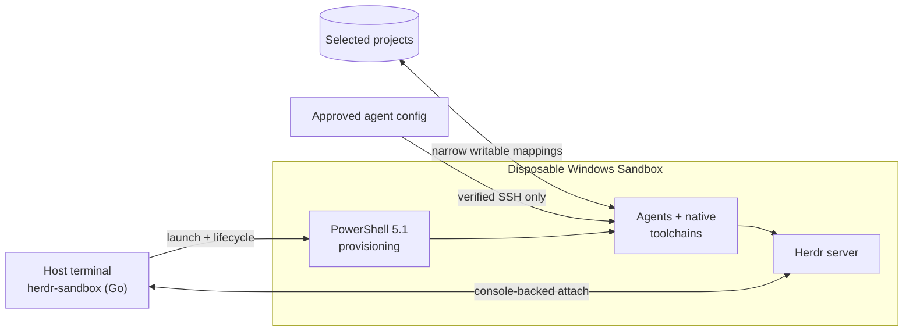

# herdr-sandbox

**Run coding agents in a disposable, native Windows development environment—without RDP, broad home-directory mounts, or host toolchain drift.**

[](https://github.com/hdosys/herdr-sandbox/actions/workflows/nightly.yml) [](https://github.com/hdosys/herdr-sandbox/actions/workflows/release.yml) [](go.mod)  [](LICENSE)

`herdr-sandbox` is a Windows-native counterpart to a [dev container](https://containers.dev/). It launches Windows Sandbox with only the selected projects, provisions native toolchains, transfers approved agent configuration over verified SSH, starts Herdr in the guest, and attaches the normal host terminal. Source edits persist on the host; guest tools and processes disappear with the Sandbox.

> [!NOTE]
> Automated checks and opt-in native acceptance gates cover the core path. Host policy, networking, upstream tools, and Windows platform changes can still affect operation.

[How it works](#how-it-works) · [Engineering](#engineering-approach) · [Get started](#get-started) · [Commands](#commands) · [Configuration](#configuration) · [Security](#security-boundaries) · [Tailscale](#stable-tailscale-tailnet-identity-experimental) · [Troubleshooting](#troubleshooting) · [Development](#development)

## How it works



The host owns source, identity, configuration, cache, and bounded run evidence. The guest owns compilation, agent execution, and disposable runtime state. Go owns host lifecycle decisions and strict boundary contracts; PowerShell is the narrow Windows provisioning adapter.

> [!IMPORTANT]
> This is practical isolation, not a complete security boundary. Selected projects remain writable and guest networking is enabled. The disposable profile also intentionally restricts protections including Defender cloud features, SmartScreen, and automatic Windows/driver updates. Keep backups and normal supply-chain controls.

## Key capabilities

- **Native Windows isolation:** real Windows toolchains run inside Windows Sandbox instead of a compatibility layer.
- **Terminal-first workflow:** Herdr provides native attach and reattach from the host terminal; routine work does not require RDP.
- **Multi-stack provisioning:** .NET 10, Go, Node.js, Python, Rust/MSVC, and Zig share one idempotent project-profile model.
- **Agent-ready guests:** approved configuration for OpenCode, Claude Code, Codex, GitHub Copilot CLI, and Pi is synchronized over verified SSH.
- **Fast iteration:** an exact ready guest can be reprovisioned and reattached without replacing it.
- **Narrow persistence:** selected source trees and a verified package cache survive; the guest operating system, tools, and processes do not.
- **Stable private reachability with Tailscale (experimental):** opt in to preserve one tagged guest identity, Tailscale IP, and MagicDNS name across fresh Sandboxes without exposing services publicly.

## Engineering approach

- **Native Windows architecture:** a standard-library-first Go control plane owns the product while PowerShell 5.1 remains a narrow Windows provisioning adapter; no CGO, helper runtime, daemon, provider framework, or alternate provisioner is required.
- **Explicit responsibility boundaries:** CLI, configuration, lifecycle, SSH, cleanup, packaging, and user/project extensions each have one owner instead of parallel implementations.
- **Defensive process and state handling:** subprocesses propagate cancellation, use focused timeouts, hide noninteractive console trees, publish state atomically, and return bounded diagnostics.
- **Strict external contracts:** JSON, XML, status, process identity, paths, downloads, release artifacts, and installer state are validated before use; uncertain destructive operations fail closed.
- **Reproducible provisioning:** exact versions, hashes, signatures, and realized state are verified where applicable; repeat runs avoid duplicate work and read back every change.
- **Release engineering:** the installer and portable ZIP share one four-file payload, checksums, deterministic ZIP output, rollback-aware upgrades, and explicit uninstall ownership.
- **Production-path verification:** focused tests, PowerShell parse checks, `go vet`, stable builds, package checks, and opt-in real Windows Sandbox all-stack acceptance exercise the same implementation shipped to users.

## Get started

### Prerequisites

- Windows 10 or Windows 11 with hardware virtualization and Windows Sandbox support.
- Windows Terminal and internet access for cache misses.
- An existing remote-capable `herdr.exe` from the maintainer's [`herdr-win`](https://github.com/hdosys/herdr-win) fork on host `PATH`.
- Go 1.26.4 or newer only when building this repository from source.

If Windows Sandbox is not enabled, run the following from elevated Windows PowerShell and restart Windows:

```powershell
Enable-WindowsOptionalFeature -Online -FeatureName Containers-DisposableClientVM -All
```

If `herdr.exe` is missing, install it from [`herdr-win`](https://github.com/hdosys/herdr-win) and place it on host `PATH`. `herdr-sandbox` verifies that command and copies the same digest-verified runtime into each fresh guest; it never installs, updates, or replaces host Herdr. Missing or unsupported builds point to `winget install --id hdosys.herdr-win --exact`.

### Install herdr-sandbox

Every [GitHub release](https://github.com/hdosys/herdr-sandbox/releases/latest) provides a per-user installer, a portable ZIP, and matching `.sha256` sidecars. Both formats contain exactly `herdr-sandbox.exe`, `base.ps1`, `stacks.ps1`, and `LICENSE.txt`.

#### Installer (recommended)

Download `herdr-sandbox_<version>_windows_amd64_setup.exe` and its `.sha256` from the latest release, verify the checksum, and run setup. It needs no administrator access, installs for the current user, adds the application to Windows Installed Apps and user `PATH`, and never launches a program or browser automatically.

> [!WARNING]
> The installer path is currently unsigned, so Windows may display a SmartScreen warning. Use it only after its SHA-256 matches the sidecar from the same release.

<details>
<summary><strong>Installer ownership and uninstall behavior</strong></summary>

- Installs to `%LOCALAPPDATA%\Programs\Herdr Sandbox` and upgrades the four packaged files as one rollback-aware set.
- Creates `config.json` and `user.ps1` only when absent; setup and upgrades never replace existing user settings.
- Adds only its own user `PATH` entry. A matching entry that existed before setup remains user-owned.
- Never bundles Herdr/Herdr-Win, agents, an updater, runtime bundles, or Windows prerequisites.
- Uninstall from **Settings → Apps → Installed apps**, or run `%LOCALAPPDATA%\Programs\Herdr Sandbox\uninstall.exe`.
- Uninstall never stops a running Sandbox. It removes app-owned runtime state, SSH integration, cache, application files, registration, and installer-owned `PATH`; a running Sandbox remains open but becomes unmanaged and must be closed manually.
- **Also delete config.json and user.ps1** is off by default, so settings survive reinstall unless you explicitly select deletion.
- Project profiles and unrelated SSH/install-directory content remain untouched. Uncertain ownership aborts before application removal.

</details>

#### WinGet

The Sandbox package ID is `hdosys.herdr-sandbox`. Its first community manifest is tracked in [microsoft/winget-pkgs#410501](https://github.com/microsoft/winget-pkgs/pull/410501). Once the public source resolves the package, install it with:

```powershell
winget install --id hdosys.herdr-sandbox --exact
```

Herdr-Win remains a separate package and is never bundled or declared as a dependency.

#### Portable ZIP

Download `herdr-sandbox_<version>_windows_amd64.zip` and its `.sha256`, verify the checksum, and extract all four files into one directory. Keep the three support files beside `herdr-sandbox.exe`, then run `.\herdr-sandbox.exe` or add that directory to user `PATH`.

#### Build from source

From the repository root:

```powershell
go run ./cmd/task check
```

The checked build writes the same four files to `build\bin`. Use that executable directly or add the directory to user `PATH`.

### Launch your first project

Commands below assume `herdr-sandbox.exe` is on `PATH`; otherwise use its full path.

#### 1. Initialize a project profile

From the project root, select one or more stacks explicitly:

```powershell
herdr-sandbox init --stack go
```

Repeat `--stack` to combine `dotnet`, `go`, `node`, `python`, `rust`, and `zig`, or omit the flag for a guided prompt. `init` validates every selection, writes one direct-call `.herdr-sandbox\provision.ps1`, and never replaces an existing or ancestor-owned profile. The nearest ancestor containing that file becomes the active project.

#### Optional: Inspect the effective plan

```powershell
herdr-sandbox plan
```

`plan` prints the validated configuration, workspaces, stacks, packages, agent-sync choices, fixed Sandbox settings, and differences from a ready guest. It does not create state, download packages, update tools, consume a Tailscale key, or execute project scripts.

#### 2. Start from the project

```powershell
herdr-sandbox up
```

The visible PowerShell bootstrap console inside Windows Sandbox is intentional and requires no interaction. A successful run creates a usable guest workspace and attaches the host Herdr client—not merely SSH or an installed toolchain.

> [!NOTE]
> Automatic attach requires real console-backed stdin, stdout, and stderr. A redirected or headless caller is rejected before cleanup or provisioning instead of sending a TUI into logs. Use the intentional headless path:

```powershell
herdr-sandbox up --no-attach
```

#### 3. Reattach

After a normal detach, the guest Herdr server remains running:

```powershell
herdr-sandbox attach
```

The verified `herdr --remote sandbox` alias remains available for direct Herdr use.

Plain SSH is available for noninteractive diagnostics:

```powershell
ssh sandbox
```

## Commands

Command output is plain and redirect-safe: summaries use descriptive headings, indented fields, deterministic ordering, and one item per line instead of packed comma-separated lists. Results go to stdout, errors go to stderr, and no color or terminal UI framework is required.

| Command | Behavior |
| --- | --- |
| `herdr-sandbox config` | Creates `config.json` when absent and opens it with the application registered for `.json` files. Existing configuration is never replaced. |
| `herdr-sandbox plan` | Prints the validated effective plan and differences from a ready guest without changing state. |
| `herdr-sandbox init [--stack NAME]...` | Creates one direct-call project profile. With no flag, prompts for stacks; existing or ancestor-owned profiles are never replaced. |
| `herdr-sandbox up [--memory-mb MB] [--timeout DURATION] [--no-attach]` | Launches and provisions a guest, or reprovisions an exact matching ready guest. It attaches unless `--no-attach` stops at terminal ready; no overall timeout applies unless requested. |
| `herdr-sandbox attach` | Verifies and attaches to the ready guest without reprovisioning. |
| `herdr-sandbox status` | Reports guest health, operation progress, workspaces, versions, timings, diagnostics, warnings, and the next action. |
| `herdr-sandbox down` | Stops only the revalidated app-owned Sandbox. If opted-in Tailscale state cannot be preserved, the guest remains running. |
| `herdr-sandbox clean` | Removes only validated inactive run workspaces while preserving active or uncertain state, configuration, projects, and cache. |

<details>
<summary><strong>Lifecycle and automatic cleanup</strong></summary>

- After valid command syntax, `up`, `status`, and `down` run the same bounded cleanup; `clean` invokes that owner directly. Help, `plan`, and invalid command lines remain nonmutating.
- Cleanup clears stale run and SSH state only when process evidence proves no Sandbox launcher or client remains. Changed, unmanaged, reparse-bearing, or uncertain state is preserved and reported.
- A freely acquired lifecycle lock records an abandoned retained operation as interrupted before another mutation can begin.
- `up` reuses only an exact ready app-owned instance. Inspect refused state with `status`, then use `down` only when the CLI identifies the app-owned guest.
- Changing Tailscale, audio, memory, cache, or workspace mappings requires `down` before the next `up`.

</details>

## Configuration

### Project profiles

Profiles call built-in stacks directly so the host can inspect requirements without executing project code:

| Development need | Direct profile call |
| --- | --- |
| Modern .NET 10 LTS SDK | `Install-DotNetStack` |
| Go | `Install-GoStack -ProjectDirectory $ProjectDirectory` |
| Node.js LTS | `Install-NodeStack` |
| Python (latest stable) | `Install-PythonStack` |
| Zig | `Install-ZigStack` |
| Rust with MSVC Build Tools | `Install-RustMSVCStack -ProjectDirectory $ProjectDirectory` |
| Cargo Nextest | `Install-CargoNextest` |
| Just | `Install-Just` |

- Keep stack calls direct—not behind aliases, dynamic invocation, or another dot-sourced file. Exact parameters and optional version selectors live in [`provisioning\stacks.ps1`](provisioning/stacks.ps1).
- An omitted version resolves the latest stable release once for cache, installation, and verification. An explicit version remains exact and never falls back silently.
- Built-in stacks own toolchains, not application dependencies. `Install-DotNetStack` installs the modern .NET 10 LTS SDK family, not .NET Framework, previews, Visual Studio, or project target frameworks.

For a project-specific tool, add idempotent Windows PowerShell 5.1 to its profile. For a package needed in every guest, use [`wingetPackages.add`](#global-configuration). There is no plugin registry or second profile format.

**Rust/MSVC note:** the first Rust-stack run may show Microsoft Visual Studio Installer on the host. The signed bootstrapper creates a verified Build Tools layout in the app-owned cache; it does not install Visual Studio or Rust on the host. The guest copies and installs from that layout.

### Global configuration

Open the global configuration with the Windows application registered for `.json` files:

```powershell
herdr-sandbox config
```

The command creates `config.json` only when absent and never replaces existing settings. Setup or the first mutating `up` also creates the user extension when absent:

```text
%APPDATA%\herdr-sandbox\config.json
%APPDATA%\herdr-sandbox\user.ps1
```

`config.json` is strict JSON, so comments are not allowed. Example:

```json
{
  "cacheDirectory": "",
  "memoryMB": 32768,
  "audio": false,
  "audioInput": false,
  "tailscale": false,
  "codingAgentSync": {
    "opencode": true,
    "claudeCode": true,
    "codex": true,
    "githubCopilot": true,
    "pi": true
  },
  "wingetPackages": {
    "remove": [],
    "add": [],
    "versions": {}
  },
  "workspaceDiscovery": {
    "root": "D:\\Projects",
    "exclude": [
      "^(archive|scratch)$",
      "(?i)^temp-"
    ]
  },
  "workspaces": {
    "external": "E:\\Clients\\external"
  }
}
```

| Field | Meaning |
| --- | --- |
| `cacheDirectory` | Absolute dedicated Herdr Sandbox package/tool cache. Empty uses `<system-temp>\herdr-sandbox\cache`. It must not overlap a workspace or app run state; every uninstall recursively removes the entire selected cache, so never point it at a shared directory. |
| `memoryMB` | Default Sandbox memory; minimum 2048. `--memory-mb` overrides one run. |
| `audio` | Exact boolean audio-output opt-in. Omitted or `false` suppresses playback; only `true` leaves playback enabled. |
| `audioInput` | Exact boolean microphone-input opt-in. Omitted or `false` blocks host microphone sharing; only `true` enables Windows Sandbox audio input. |
| `tailscale` | Exact boolean opt-in for the stable tagged identity. Omitted or `false` leaves Tailscale install-only. |
| `codingAgentSync` | Five exact booleans; all default to `true`. Set one to `false` to skip that agent. |
| `workspaceDiscovery` | Optional direct-child project discovery with an absolute `root` and multiple `exclude` regular expressions. Empty or omitted `root` disables it. |
| `workspaces` | Additional unique workspace names mapped to absolute host project roots. |
| `wingetPackages.remove` | Known optional Base packages to omit. Core packages cannot be removed. |
| `wingetPackages.add` | Exact additional WinGet package IDs installed in every guest. |
| `wingetPackages.versions` | Exact versions for retained or added packages. Omitted versions resolve latest; unavailable exact versions fail. After a successful install, an inconclusive WinGet read-back warns and continues. |

#### Audio policy

Both audio toggles default off. With both off, provisioning selects Windows **No Sounds**, mutes the default render endpoint, and disables the guest audio services with read-back verification. Ordinary applications therefore cannot restore playback by changing only their own volume.

Set `"audioInput": true` to share the host microphone and retain the shared audio services. Because capture and playback use those services together, guest applications can then unmute output even while `audio` remains false; these controls are not a security boundary against guest administrator code. Set `"audio": true` independently for deliberate playback. Changing either toggle requires `down` before the next `up`.

No CPU-priority option is exposed because Windows Sandbox provides no supported per-instance control; changing the launcher priority would not reliably control guest vCPU scheduling.

#### Agent packages

To install every coding agent that currently has a verified WinGet package, set `wingetPackages` to this copy-paste object:

```json
{
  "remove": [],
  "add": [
    "Anthropic.ClaudeCode",
    "OpenAI.Codex",
    "GitHub.Copilot"
  ],
  "versions": {}
}
```

OpenCode (`SST.opencode`) is already a Base default and must not be added again. Pi does not currently have a verified WinGet package; install it explicitly in the project profile that needs it. `codingAgentSync` controls configuration/authentication transfer only and does not install an agent.

#### Coding-agent sync

Configuration sync is default-on when these host surfaces exist:

| Agent | Configuration/authentication behavior |
| --- | --- |
| OpenCode | Copies approved config/data files and portable `auth.json`. |
| Claude Code | Copies approved `.claude` configuration and `.credentials.json`. |
| Codex | Copies approved `CODEX_HOME` content and file-mode credentials. Keyring credentials stay host-bound. |
| GitHub Copilot CLI | Copies approved config and reuses successfully imported GitHub CLI accounts. Native Credential Manager tokens stay host-bound. |
| Pi | Copies approved agent configuration and portable `auth.json`. |

The shared `%USERPROFILE%\.agents\skills` tree is copied once when Codex, Copilot, or Pi is enabled. Conversations, history, logs, caches, generated plugin/package state, project trust, private SSH/GPG keys, and unrelated home content are excluded. Missing host configuration is a clean no-op. This feature copies setup only; it does not install Claude Code, Codex, Copilot, or Pi.

#### Workspace discovery

- Discovery checks only direct child directories and never maps the root itself. Each Go/RE2 `exclude` expression is case-sensitive unless it uses `(?i)`; any match excludes that child.
- Every selected child becomes a workspace even without `.herdr-sandbox\provision.ps1`. When that optional script exists it is validated and run; the folder name becomes the workspace name. Use `workspaces` for external projects or explicit names, which win when both select the same path.
- The active project is added and deduplicated automatically. At most 16 physical, existing, nonoverlapping, non-reparse workspaces are allowed; a changed set requires `down` before the next `up`.

#### Global extension ownership

- `base.ps1` and `stacks.ps1` are release-owned and update with the application.
- `user.ps1` is seeded once for idempotent global PowerShell additions and runs before project profiles.
- Keep package selection in `config.json` and project-specific behavior in each project profile.
- Do not store credentials or print secrets from `user.ps1`; its immutable snapshot may remain with active or uncertain run diagnostics until safe cleanup.

Older releases seeded a user-owned `%APPDATA%\herdr-sandbox\base.ps1`. The new ownership model never overwrites or executes that file: `up` stops with migration instructions. Review it, move only deliberate global extension commands into `user.ps1`, move package choices into `config.json`, keep project tools in project profiles, archive the complete legacy Base under a non-reserved name, and retry.

#### Persistent host state

Persistent host state is split intentionally:

| Path | Contents |
| --- | --- |
| `%APPDATA%\herdr-sandbox` | User-owned global config and `user.ps1` extension. |
| `%LOCALAPPDATA%\herdr-sandbox\identity` | Host SSH identity and optional DPAPI-protected Tailscale identity. |
| `%LOCALAPPDATA%\herdr-sandbox\runs` | Per-run status, diagnostics, host-owned retained-operation state, SSH material, and `.wsb` files. Do not edit an active run. |
| `%LOCALAPPDATA%\herdr-sandbox\ssh\config` | App-owned `Host sandbox` target for the current guest; removed automatically only when no Sandbox is proven to remain. |
| `<system-temp>\herdr-sandbox\cache` | Default persistent package/tool cache. |

## Security boundaries

- Writable host mappings are limited to selected project roots, the explicit package/tool cache, and bounded per-run status; networking remains enabled.
- The host home directory, general AppData, unrelated repositories, and private SSH/GPG keys are never mapped; only the app-owned public SSH key enters the guest.
- Approved GitHub CLI and coding-agent credentials travel only over verified SSH and never enter persistent run input or logs. Machine-bound credentials require a guest login.
- Tailscale auth-key and state bytes never enter mappings, status, diagnostics, command lines, or package cache.
- Guest OpenCode managed policy resolves every permission to `allow`; host OpenCode policy is unchanged. Treat guest agents as fully authorized inside the Sandbox and mapped projects.
- The reviewed disposable-guest privacy profile intentionally restricts Defender cloud/security features, SmartScreen, automatic updates, telemetry, and related services. It is not a hardened production workstation profile.
- Downloads and cache hits are validated against strict versions, metadata, hashes, signatures, or package identity as applicable.
- Host Rust tooling is forbidden. Rust installation, builds, and tests belong only in the verified guest or GitHub Actions.
- Lifecycle commands revalidate exact app-owned process/path identity and refuse unrelated, changed, or reparse-bearing state.

## Stable Tailscale tailnet identity (experimental)

> [!CAUTION]
> The required two-fresh-Sandbox identity and peer-connectivity acceptance gate remains open. Use this opt-in only with a tailnet prepared for a dedicated tagged device.

`herdr-sandbox` joins an existing user-owned tailnet; it does not create the tailnet or manage policy. The stable address lets an approved phone, tablet, or computer reach services in the running Sandbox without publishing them to the internet. Leave `"tailscale": false` for a manually managed disposable login whose identity is not preserved.

Tailscale supplies only the private network path. Another device still needs a compatible client and an explicitly authorized credential; the default OpenSSH endpoint accepts only the app-owned host identity. Never copy that private key to another device.

<details>
<summary><strong>First-time tailnet and enrollment setup</strong></summary>

### 1. Prepare the tailnet

In the [Tailscale admin console](https://login.tailscale.com/admin):

1. Create or open the target tailnet and enable MagicDNS.
2. Add a dedicated tag with least-privilege access.
3. Merge policy entries such as the following; do not replace unrelated policy:

```json
{
  "tagOwners": {
    "tag:herdr-sandbox": ["autogroup:admin"]
  },
  "acls": [
    {
      "action": "accept",
      "src": ["autogroup:admin"],
      "dst": ["tag:herdr-sandbox:22"]
    }
  ]
}
```

Replace the source and ports with the users, groups, and services actually required. See Tailscale's [tag](https://tailscale.com/docs/features/tags) and [access-control](https://tailscale.com/docs/features/access-control) documentation.

### 2. Create the one-time key

Create one auth key on the admin console's Keys page:

- **Reusable:** off
- **Ephemeral:** off
- **Pre-approved/pre-authorized:** on when device approval is enabled
- **Tags:** `tag:herdr-sandbox`

If Tailnet Lock is enabled, sign the key from an existing trusted node first. Never put it in `config.json`, provisioning, shell history, or an argument to `herdr-sandbox up` or `tailscale up`.

### 3. Enable and enroll

Set `"tailscale": true` in `%APPDATA%\herdr-sandbox\config.json`. A minimal `{ "tailscale": true }` file is valid; before the first-ever `up`, create that file with an editor. Keep `Tailscale.Tailscale` in the Base package plan.

From the intended project directory, pass the key once without putting it in command history:

```powershell
$keyPointer = [Runtime.InteropServices.Marshal]::SecureStringToBSTR(
    (Read-Host 'One-off tagged Tailscale auth key' -AsSecureString)
)
try {
    $env:HERDR_SANDBOX_TAILSCALE_AUTH_KEY = [Runtime.InteropServices.Marshal]::PtrToStringBSTR($keyPointer)
    herdr-sandbox up
} finally {
    Remove-Item Env:HERDR_SANDBOX_TAILSCALE_AUTH_KEY -ErrorAction SilentlyContinue
    [Runtime.InteropServices.Marshal]::ZeroFreeBSTR($keyPointer)
}
```

The CLI removes its inherited environment copy before launching children, enrolls fixed hostname `herdr-sandbox`, verifies the tagged identity, and stores node state only as current-user DPAPI ciphertext. Confirm exactly one tagged device in the admin console and verify the route from an intended peer with `tailscale ping herdr-sandbox`; service login still requires its own authorized credential.

### 4. Later Sandboxes

Do not supply the auth key again. `down` captures and verifies current state before closing; the next fresh `up` restores it over verified SSH. Device ID, node key, IPv4, MagicDNS, hostname, tags, and Windows Sandbox user SID must remain exact or the workflow fails closed.

Keep node-key expiry disabled. Do not delete the tailnet device or `%LOCALAPPDATA%\herdr-sandbox\identity\tailscale-identity.json` while expecting restoration. The protected identity is bound to the current Windows host user and is not a portable backup.

</details>

## Troubleshooting

Start with `herdr-sandbox status`; it preserves a running guest, removes only proven stale state, and reports the next action.

| Symptom | Action |
| --- | --- |
| Windows Sandbox is unavailable | Enable `Containers-DisposableClientVM` from elevated Windows PowerShell, restart Windows, and confirm hardware virtualization is enabled. |
| `up` refuses an existing Sandbox | A ready exact guest is reused automatically. A normally closed window is cleaned on the next valid command. For failed, changed-plan, unmanaged, or ownership-uncertain state, inspect the reported evidence and use `herdr-sandbox down` only when it identifies the app-owned instance. |
| Automatic attach is unavailable in a headless process | Provision intentionally with `herdr-sandbox up --no-attach`, then open a real terminal and run `herdr-sandbox attach`; a verified ready guest remains reusable. |
| The guest has no playback audio | Audio output is off by default. Set `"audio": true` in `config.json`, run `herdr-sandbox down`, then start a fresh guest with `up`. This does not enable microphone input. |
| The guest cannot use the microphone | Microphone input is off by default. Set `"audioInput": true` in `config.json`, run `herdr-sandbox down`, then start a fresh guest with `up`. Host microphone permissions or policy can still block sharing. |
| `ssh sandbox` no longer connects | Run `herdr-sandbox status`. If no Sandbox remains, startup cleanup removes the stale target and reports `stopped`; run `up` to create the next verified target. Ownership uncertainty is preserved and reported instead of guessed. |
| Legacy global Base is refused | Preserve `%APPDATA%\herdr-sandbox\base.ps1`, move only deliberate additions to `user.ps1`/config/project ownership, archive the legacy file under a non-reserved name, and retry. |
| Initial provisioning is slow | The first run may download WinGet, OpenSSH, selected SDKs such as modern .NET or Rust, and the Visual Studio layout required only by Rust/MSVC. Herdr is copied from the host and does not use the download cache. Confirm that the cache is writable and does not overlap a workspace or run state. |
| Stable Tailscale enrollment is refused | Confirm exact `true`, the retained Tailscale package, and a current one-time non-ephemeral pre-approved tagged key. Restoration refuses missing, corrupt, differently DPAPI-bound, untagged, or identity-mismatched state. |
| Old diagnostics consume space | `up`, `status`, and `down` remove validated inactive run workspaces automatically; `clean` invokes the same cleanup explicitly once. Active/uncertain evidence and the persistent cache remain preserved. |

## Development

Repository tasks:

```powershell
go run ./cmd/task fmt
go run ./cmd/task test
go run ./cmd/task build
go run ./cmd/task check
go run ./cmd/task native-all-stacks
go run ./cmd/task package v0.0.0
```

- `check` covers Go formatting, Windows PowerShell 5.1 parsing, all Go tests, `go vet`, and the stable `build\bin` artifact.
- `native-all-stacks` provisions one fresh real Sandbox with .NET, Go, Node.js, Python, Rust/MSVC, and Zig; it runs representative version/build/test commands over managed SSH, verifies Terminal and Starship transfer, and closes only its exact app-owned guest. It requires Windows Sandbox, network/package access, host Herdr, and GitHub CLI.
- `package` uses pinned NSIS 3.12 and writes the installer, ZIP, and both checksum files under `build\dist` without installing them.
- Repository provisioning and installer helpers run exclusively under Windows PowerShell 5.1; installed PowerShell 7 remains interactive guest tooling.

## License

`herdr-sandbox` is licensed under the [Apache License, Version 2.0](LICENSE) and is provided on an **"AS IS" BASIS, WITHOUT WARRANTIES OR CONDITIONS OF ANY KIND**. See the license for the governing terms, including its warranty disclaimer and limitation of liability.

## Documentation

- Stable user-visible behavior: [`PRODUCT.md`](PRODUCT.md)
- Technical boundaries: [`ARCHITECTURE.md`](ARCHITECTURE.md)
- Open work: [`BACKLOG.md`](BACKLOG.md)
- Project-specific agent/repository rules: [`AGENTS.md`](AGENTS.md)
