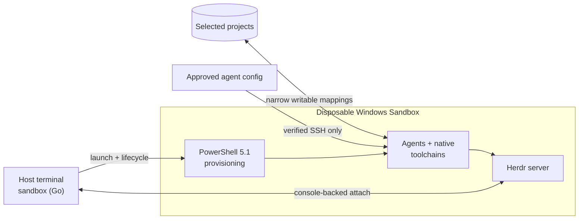

# herdr-sandbox

**Run coding agents in a disposable, native Windows development environment without RDP, broad home-directory mounts, or host toolchain drift.**

[](https://github.com/hdosys/herdr-sandbox/actions/workflows/nightly.yml) [](https://github.com/hdosys/herdr-sandbox/actions/workflows/release.yml) [](go.mod)  [](LICENSE)

Herdr Sandbox is a Windows-native counterpart to a [dev container](https://containers.dev/). Its `sandbox` command launches Windows Sandbox with only the selected projects, provisions native toolchains, transfers approved agent configuration over verified SSH, starts Herdr in the guest, and attaches the normal host terminal. Source edits persist on the host; guest tools and processes disappear with the Sandbox.

> [!NOTE]
> Automated checks and opt-in native acceptance gates cover the core path. Host policy, networking, upstream tools, and Windows platform changes can still affect operation.

[How it works](#how-it-works) · [Stacks](#supported-stacks) · [Get started](#get-started) · [Commands](#commands) · [Configuration](#configuration) · [Security](#security-boundaries) · [Troubleshooting](#troubleshooting) · [Development](#development)

## How it works



The host owns source, identity, configuration, cache, and bounded run evidence. The guest owns compilation, agent execution, and disposable runtime state. Go owns host lifecycle decisions and strict boundary contracts; PowerShell is the narrow Windows provisioning adapter.

> [!IMPORTANT]
> This is practical isolation, not a complete security boundary. Selected projects remain writable and guest networking is enabled. The disposable profile also intentionally restricts protections including Defender cloud features, SmartScreen, and automatic Windows/driver updates. Keep backups and normal supply-chain controls.

## Key capabilities

- **Native Windows isolation:** real Windows toolchains run inside Windows Sandbox instead of a compatibility layer.
- **Terminal-first workflow:** Herdr provides native attach and reattach from the host terminal; routine work does not require RDP.
- **Project-aware provisioning:** reusable technology and tool stacks combine through one idempotent project profile, with separate shortcuts for complex project setups.
- **Agent-ready guests:** approved configuration for OpenCode, Claude Code, Codex, GitHub Copilot CLI, and Pi is synchronized over verified SSH.
- **Fast iteration:** an exact ready guest can be reprovisioned and reattached without replacing it.
- **Narrow persistence:** selected source trees and a verified package cache survive; the guest operating system, tools, and processes do not.
- **QR-assisted mobile Herdr over Tailscale (experimental):** preserve one tagged guest identity and connect from an authorized phone, tablet, or computer through a key-only private endpoint without publishing a service to the internet.

## Supported stacks

`sandbox init --stack` offers reusable technology and tool stacks plus separate project shortcuts. Use `--stack all` for every standalone technology and tool stack, or repeat the flag to combine compatible individual selections.

### Technology and tool stacks

| Selection | Guest tooling |
| --- | --- |
| `all` | Every standalone built-in: Android, Bun, Cargo Nextest, C/C++, .NET, Go, Java, Just, Node/Playwright, NSIS, Playwright CLI, Python, Rust/MSVC, TradingView, uv, and Zig; project shortcuts remain separate |
| `android` | Android SDK command-line tools, Platform Tools/ADB, and an isolated Microsoft OpenJDK 17 |
| `cpp` | C and C++ with MSVC Build Tools and Windows 11 SDK 26100 |
| `dotnet` | .NET 10 LTS SDK |
| `go` | Go |
| `java` | Microsoft OpenJDK 25 LTS |
| `node` | Node.js LTS, Playwright, and Chromium |
| `nsis` | NSIS compiler for building Windows installers |
| `playwright-cli` | Playwright CLI without a bundled browser |
| `python` | Latest stable Python |
| `rust` | Rust with MSVC Build Tools |
| `tradingview` | TradingView Desktop and TVControl |
| `zig` | Zig |

### Project shortcuts

| Shortcut | Intended setup |
| --- | --- |
| `handy` | The current Handy Windows checkout, including Bun, Rust/MSVC, CMake, Vulkan SDK, and WebView2 |
| `herdr` | Herdr and Herdr-Win checkouts, including Python, Rust/MSVC, Zig, Bun, Cargo Nextest, Just, and Git for Windows `sh` |
| `python-ai` | Python 3.13 and uv for CPU inference, notebooks, and API-based projects |

Project shortcuts do not represent additional technologies. They package complex project setup for convenience. Their preferred long-term home is the repository they serve, in its own `.herdr-sandbox\provision.ps1`. Dependencies, application commands, and release workflows remain project-owned. `sandbox plan` expands each shortcut into its concrete stack owners without executing the profile.

## Deployment time

There is no separate VM to set up or maintain, and only selected stacks are provisioned. With downloads cached, a fresh Sandbox is usually ready in **2 to 4 minutes** without Rust/MSVC and **4 to 6 minutes** with it. First runs can take longer when browser, Vulkan SDK, or Visual Studio payloads must be downloaded. Attaching to an already ready Sandbox skips provisioning.

## Engineering approach

- **Native Windows architecture:** a standard-library-first Go control plane owns the product while PowerShell 5.1 remains a narrow Windows provisioning adapter; no CGO, helper runtime, daemon, provider framework, or alternate provisioner is required.
- **Explicit responsibility boundaries:** CLI, configuration, lifecycle, SSH, cleanup, packaging, and user/project extensions each have one owner instead of parallel implementations.
- **Defensive process and state handling:** subprocesses propagate cancellation, use focused timeouts, hide noninteractive console trees, publish state atomically, and return bounded diagnostics.
- **Strict external contracts:** JSON, XML, status, process identity, paths, downloads, release artifacts, and installer state are validated before use; uncertain destructive operations fail closed.
- **Reproducible provisioning:** exact versions, hashes, signatures, and realized state are verified where applicable; repeat runs avoid duplicate work and read back every change.
- **Release engineering:** the installer and portable ZIP share one four-file payload, deterministic ZIP output, GitHub-verified asset digests, in-process file rollback, and product-GUID/marker-bound uninstall ownership.
- **Production-path verification:** focused tests, PowerShell parse checks, `go vet`, stable builds, package checks, and opt-in real Windows Sandbox all-stack acceptance exercise the same implementation shipped to users.

## Get started

### Prerequisites

- Windows 10 or Windows 11 with hardware virtualization and Windows Sandbox support.
- Windows Terminal and internet access for cache misses.
- The `herdr-win` Windows `herdr.exe` on host `PATH`; `herdr --version` must begin
  with `herdr-win ` and its `--remote` interface must pass the capability probe.
- Go 1.26.4 or newer only when building this repository from source.

If Windows Sandbox is not enabled, run the following from elevated Windows PowerShell and restart Windows:

```powershell
Enable-WindowsOptionalFeature -Online -FeatureName Containers-DisposableClientVM -All
```

[`herdr-win`](https://github.com/hdosys/herdr-win) is the required Windows remote distribution. Herdr Sandbox checks that the existing `herdr.exe` on `PATH` reports a `herdr-win ` identity, separately probes its remote interface, copies the status-reported physical executable and optional complete ConPTY bundle into each fresh guest, and never installs, updates, or replaces host Herdr.

### Install Herdr Sandbox

Every [GitHub release](https://github.com/hdosys/herdr-sandbox/releases/latest) provides a per-user installer and a portable ZIP. GitHub records and displays the SHA-256 digest of each asset. Both formats contain exactly `sandbox.exe`, `base.ps1`, `stacks.ps1`, and `LICENSE.txt`.

#### Installer (recommended)

Download `herdr-sandbox_<version>_windows_amd64_setup.exe` from the latest release, compare `Get-FileHash -Algorithm SHA256 <path>` with the digest GitHub displays for that asset, and run setup. It needs no administrator access, installs for the current user, and adds the application to Windows Installed Apps and user `PATH`. A fresh interactive install shows a checked **Open Herdr Sandbox configuration** option on the Finish page. Leave it selected to open `%APPDATA%\herdr-sandbox\config.json` with the application registered for `.json` files. Standard WinGet and other silent installs, plus repairs and upgrades, do not show the option or open the file.

> [!WARNING]
> The installer path is currently unsigned, so Windows may display a SmartScreen warning. Use it only after its SHA-256 matches GitHub's digest for the same release asset.

<details>
<summary><strong>Installer ownership and uninstall behavior</strong></summary>

- Installs to `%LOCALAPPDATA%\Programs\Herdr Sandbox`. A permanent product GUID, the registered location, and a matching marker establish ownership; setup refuses a nonempty unmarked directory.
- Setup stages and backs up the four-file payload, restores a failed replacement, and repairs a marked interrupted install when rerun. It does not promise rollback after power loss.
- Reparse points, inaccessible state, locked application files, and unknown siblings fail closed or remain preserved for a later repair.
- Setup, uninstall, and application commands share one cross-session gate. The installer adds at most one owned user `PATH` entry, and uninstall removes only that entry.
- `config.json` and `user.ps1` are created only when absent and survive upgrades. They also survive uninstall unless **Also delete config.json and user.ps1** or silent `/DELETE_CONFIG` is selected.
- Uninstall from **Settings → Apps → Installed apps**, or run `%LOCALAPPDATA%\Programs\Herdr Sandbox\uninstall.exe`. It validates ownership, closes only a proven app-owned Sandbox, and removes only exact app-owned SSH, machine-local, cache, registration, and application state. Silent blockers return a nonzero status; interactive uninstall can preserve residual state and continue explicitly.
- Herdr/Herdr-Win, agents, updaters, runtime bundles, Windows prerequisites, project profiles, unrelated SSH content, and unselected user configuration remain outside installer ownership.

</details>

#### WinGet

The Sandbox package ID is `hdosys.herdr-sandbox`. Its first community manifest is tracked in [microsoft/winget-pkgs#410501](https://github.com/microsoft/winget-pkgs/pull/410501). Once the public source resolves the package, install it with:

```powershell
winget install --id hdosys.herdr-sandbox --exact
```

Herdr-Win remains a separate package and is never bundled or declared as a dependency.

#### Portable ZIP

Download `herdr-sandbox_<version>_windows_amd64.zip`, verify its GitHub SHA-256 asset digest, and extract all four files into one directory. Keep the three support files beside `sandbox.exe`, then run `.\sandbox.exe` or add that directory to user `PATH`.

#### Build from source

From the repository root:

```powershell
go run ./cmd/task check
```

The checked build writes the same four files to `build\bin`. Use that executable directly or add the directory to user `PATH`.

### Launch your first project

Commands below assume `sandbox.exe` is on `PATH`; otherwise use its full path.

#### 1. Initialize a project profile

From the project root, select one or more stacks explicitly:

```powershell
sandbox init --stack go
```

To select every standalone technology and tool stack at once:

```powershell
sandbox init --stack all
```

For an official Herdr upstream checkout without a project profile, select its project shortcut:

```powershell
sandbox init --stack herdr
```

Repeat `--stack` to combine compatible individual selections from [Supported stacks](#supported-stacks), or omit it for a guided prompt. `all` cannot be combined with another selection and excludes project-specific shortcuts. Project shortcuts cannot be combined with stacks they already include. `init` writes one direct-call `.herdr-sandbox\provision.ps1` and never replaces an existing or ancestor-owned profile. The nearest ancestor containing that file becomes the active project.

#### Optional: Inspect the effective plan

```powershell
sandbox plan
```

`plan` prints the validated configuration, workspaces, stacks, packages, agent-sync choices, fixed Sandbox settings, and differences from a ready guest. It does not create state, download packages, update tools, consume a Tailscale key, or execute project scripts.

#### 2. Start from the project

```powershell
sandbox up
```

The visible PowerShell bootstrap console inside Windows Sandbox is intentional and requires no interaction. A successful run creates a usable guest workspace and attaches the host Herdr client, not merely SSH or an installed toolchain.

> [!NOTE]
> Automatic attach requires real console-backed stdin, stdout, and stderr. A redirected or headless caller is rejected before cleanup or provisioning instead of sending a TUI into logs. Use the intentional headless path:

```powershell
sandbox up --no-attach
```

#### 3. Reattach

After a normal detach, the guest Herdr server remains running:

```powershell
sandbox attach
```

The verified `herdr --remote sandbox` alias remains available for direct Herdr use.

Plain SSH is available for noninteractive diagnostics:

```powershell
ssh sandbox
```

## Commands

Command output is plain and redirect-safe: summaries use descriptive headings, indented fields, deterministic ordering, and one item per line instead of packed comma-separated lists. Results go to stdout, errors go to stderr, and no color or terminal UI framework is required.

| Command | Behavior |
| --- | --- |
| `sandbox config` | Creates `config.json` when absent and opens it with the application registered for `.json` files. Existing configuration is never replaced. |
| `sandbox version` | Prints the embedded application version and abbreviated source revision, or explicitly reports an unknown development revision. |
| `sandbox plan` | Prints the validated effective plan and differences from a ready guest without changing state. |
| `sandbox init [--stack NAME]...` | Creates one direct-call project profile. With no flag, prompts for stacks; existing or ancestor-owned profiles are never replaced. |
| `sandbox up [--memory-mb MB] [--timeout DURATION] [--no-attach]` | Launches and provisions a guest, or reprovisions an exact matching ready guest. It attaches unless `--no-attach` stops at terminal ready; no overall timeout applies unless requested. |
| `sandbox attach` | Verifies and attaches to the ready guest without reprovisioning. |
| `sandbox status` | Reports guest health, operation progress, workspaces, versions, timings, diagnostics, warnings, and the next action. |
| `sandbox mobile` | Prints the ready mobile SSH URI, pinned host-key fingerprint, and secret-free QR code. |
| `sandbox down` | Stops only the revalidated app-owned Sandbox. If opted-in Tailscale state cannot be preserved, the guest remains running. |
| `sandbox clean` | Removes only validated inactive run workspaces while preserving active or uncertain state, configuration, projects, and cache. |

<details>
<summary><strong>Lifecycle and automatic cleanup</strong></summary>

- After valid command syntax, `up`, `status`, and `down` run the same bounded cleanup; `clean` invokes that owner directly. Help, `plan`, and invalid command lines remain nonmutating.
- Cleanup clears stale run and SSH state only when process evidence proves no Sandbox launcher or client remains. Changed, unmanaged, reparse-bearing, or uncertain state is preserved and reported.
- A freely acquired lifecycle lock records an abandoned retained operation as interrupted before another mutation can begin.
- `up` reuses only an exact ready app-owned instance. Inspect refused state with `status`, then use `down` only when the CLI identifies the app-owned guest.
- Changing Tailscale, mobile SSH authorized keys, audio, memory, cache, folder mounts, or workspace mappings requires `down` before the next `up`.

</details>

## Configuration

### Project profiles

Profiles call built-in functions directly so `sandbox plan` can inspect requirements without executing project code.

**Reusable stack functions**

| Guest tooling | Direct profile call |
| --- | --- |
| Android SDK command-line tools and wireless ADB | `Install-AndroidStack` |
| Bun | `Install-BunStack` |
| Cargo Nextest | `Install-CargoNextest` |
| C and C++ with MSVC Build Tools | `Install-CppStack` |
| .NET 10 LTS SDK | `Install-DotNetStack` |
| Go | `Install-GoStack -ProjectDirectory $ProjectDirectory` |
| Java 25 LTS with Microsoft OpenJDK | `Install-JavaStack` |
| Just | `Install-Just` |
| Node.js LTS with Playwright and Chromium | `Install-NodeStack` |
| NSIS installer compiler | `Install-NSISStack` |
| Playwright CLI without a bundled browser | `Install-PlaywrightCLIStack` |
| Python | `Install-PythonStack` |
| Rust with MSVC Build Tools | `Install-RustMSVCStack -ProjectDirectory $ProjectDirectory` |
| TradingView Desktop with TVControl | `Install-TradingViewStack` |
| uv | `Install-Uv` |
| Zig | `Install-ZigStack` |

**Project shortcut functions**

| Project setup | Direct profile call |
| --- | --- |
| Handy Windows development | `Install-HandyStack -ProjectDirectory $ProjectDirectory` |
| Herdr/Herdr-Win development | `Install-HerdrStack -ProjectDirectory $ProjectDirectory` |
| Python 3.13 AI/API development with uv | `Install-PythonAIStack` |

- Keep calls direct, not behind aliases, dynamic invocation, or another dot-sourced file. Exact parameters and optional version selectors live in [`provisioning\stacks.ps1`](provisioning/stacks.ps1).
- Shortcut functions are the temporary convenience compositions described under [Project shortcuts](#project-shortcuts). Prefer project-owned direct calls once a repository carries its own setup.
- Unless a stack owns an explicit constraint, an omitted version resolves latest stable once for installation and verification. Node resolves `playwright@latest`; the separate Playwright CLI stack currently pins `@playwright/cli@0.1.17`. Exact requests never fall back silently.
- The `cpp` stack reuses the same host-prepared Visual Studio 2022 Build Tools and Windows 11 SDK as Rust, then exposes verified x64 C, C++, resource, linker, NMake, and MSBuild commands to every guest shell. The `java` stack installs the latest Microsoft OpenJDK 25 LTS update and exposes verified `JAVA_HOME`, `java`, and `javac` commands.
- The `android` stack installs Google's signed command-line tools and latest stable Platform Tools under `C:\HerdrSandbox\tools\android-sdk`, sets `ANDROID_HOME`, and provides an isolated Microsoft OpenJDK 17 at `ANDROID_JAVA_HOME`. An Android-only profile also activates that JDK for terminal Gradle builds when no machine `JAVA_HOME` exists. It never replaces an existing `JAVA_HOME`, and a selected standalone Java stack remains the final Java 25 owner. Android SDK platforms, build-tools versions, Gradle wrappers, application dependencies, and project files remain project-owned.
- The `nsis` stack installs the latest stable `NSIS.NSIS` compiler by default and proves a real installer compile. Use it alone with `sandbox init --stack nsis` for installer-only projects. This repository pins NSIS 3.12 in its own project profile because the release package task requires that exact compiler.
- Built-ins install guest toolchains, not project dependencies. Keep application packages and lockfiles in the project's `package.json`, `pyproject.toml`, `uv.lock`, or equivalent owner.

#### Android device connection

Select the Android stack and provision the guest:

```powershell
sandbox init --stack android
sandbox up
```

Android 11 and newer support wireless debugging. Put the phone and Sandbox on the same reachable network, enable **Developer options > Wireless debugging** on the phone, choose **Pair device with pairing code**, then run the displayed endpoints inside the guest:

```powershell
adb pair <phone-ip>:<pairing-port>
adb connect <phone-ip>:<debugging-port>
adb devices -l
```

The pairing and debugging ports can differ. Use the exact values shown by the phone. Pairing keys remain disposable guest state. Windows Sandbox does not expose a supported arbitrary USB passthrough contract, so this stack does not run a host ADB proxy or map device credentials into the guest. Use a normal host toolchain when a workflow specifically requires USB, `fastboot`, recovery, or restricted-network reliability.

#### Playwright CLI integration

[Playwright CLI](https://github.com/microsoft/playwright-cli) supports both Chrome and Edge extension channels. This built-in stack installs the exact approved CLI without a browser, then prepares the official extension specifically for the Edge profile already available in Windows Sandbox. The Edge-specific steps below are this stack's current integration choice, not a Playwright CLI limitation.

```powershell
sandbox init --stack playwright-cli
```

The stack also installs Node.js LTS, exposes only `playwright-cli.cmd`, and registers Microsoft's official [Playwright Extension](https://chromewebstore.google.com/detail/playwright-extension/mmlmfjhmonkocbjadbfplnigmagldckm) from the Chrome Web Store. Edge may require one manual enable/install action after its next launch. Click the extension icon, copy its `PLAYWRIGHT_MCP_EXTENSION_TOKEN` value, and place that value only in the disposable guest environment:

```powershell
$env:PLAYWRIGHT_MCP_EXTENSION_TOKEN = '<token from the extension>'
[Environment]::SetEnvironmentVariable('PLAYWRIGHT_MCP_EXTENSION_TOKEN', $env:PLAYWRIGHT_MCP_EXTENSION_TOKEN, 'User')
```

Attach every automation session to the same existing profile and detach without closing Edge:

```powershell
playwright-cli.cmd -s=edge-main attach --extension=msedge
# Run playwright-cli.cmd -s=edge-main commands here.
playwright-cli.cmd -s=edge-main detach
```

Without the token, the official extension asks the user to approve and select a tab. The token bypasses that dialog. A fresh Sandbox has a fresh Edge profile, so the manual extension/token step must currently be repeated. Do not use `playwright-cli open`, `install-browser`, `--persistent`, `--profile`, or another browser/profile with this stack.

For a project-specific tool, add idempotent Windows PowerShell 5.1 to its profile. For a package needed in every guest, use [`wingetPackages.add`](#global-configuration). There is no plugin registry or second profile format.

**Rust/MSVC note:** the first Rust-stack run may show Microsoft Visual Studio Installer on the host. The signed bootstrapper creates a verified Build Tools layout in the app-owned cache; it does not install Visual Studio or Rust on the host. The guest copies and installs from that layout.

### Global configuration

Open the global configuration with the Windows application registered for `.json` files:

```powershell
sandbox config
```

The command creates `config.json` only when absent and never replaces existing settings. Setup or the first mutating `up` also creates the user extension when absent:

```text
%APPDATA%\herdr-sandbox\config.json
%APPDATA%\herdr-sandbox\user.ps1
```

`config.json` is strict JSON, so comments are not allowed. Replace the example paths with existing folders. Object keys such as `external` and `shared` are user-chosen names; they become the final guest-folder name rather than a fixed keyword. Optional sections can stay empty.

```json
{
  "cacheDirectory": "",
  "memoryMB": 32768,
  "audio": false,
  "audioInput": false,
  "tailscale": false,
  "mobileSSHAuthorizedKeys": [],
  "codingAgentSync": {
    "opencode": true,
    "claudeCode": true,
    "codex": true,
    "githubCopilot": true,
    "pi": true
  },
  "workspaces": {
    "external": "E:\\Clients\\external"
  },
  "mounts": {
    "shared": {
      "path": "E:\\Shared",
      "readOnly": true
    }
  },
  "workspaceDiscovery": {
    "root": "D:\\Projects",
    "exclude": [
      "^(archive|scratch)$",
      "(?i)^temp-"
    ]
  },
  "wingetPackages": {
    "remove": [],
    "add": [
      "SST.opencode",
      "Anthropic.ClaudeCode",
      "OpenAI.Codex",
      "GitHub.Copilot"
    ],
    "versions": {}
  }
}
```

| Field | Meaning |
| --- | --- |
| `cacheDirectory` | Absolute dedicated Herdr Sandbox package/tool cache. Empty uses `<system-temp>\herdr-sandbox\cache`. It must not overlap a workspace or app run state; every uninstall recursively removes the entire selected cache, so never point it at a shared directory. |
| `memoryMB` | Default Sandbox memory; minimum 2048. `--memory-mb` overrides one run. |
| `audio` | Exact boolean audio-output opt-in. Omitted or `false` suppresses playback; only `true` leaves playback enabled. |
| `audioInput` | Exact boolean microphone-input opt-in. Omitted or `false` blocks host microphone sharing; only `true` enables Windows Sandbox audio input. |
| `tailscale` | Exact boolean opt-in for the stable tagged identity. Omitted or `false` leaves Tailscale install-only. |
| `mobileSSHAuthorizedKeys` | Up to eight unique device-owned `ssh-ed25519` public keys. A nonempty array requires `tailscale: true`; changing it requires a fresh Sandbox. Never put private keys here. |
| `codingAgentSync` | Five exact booleans; all default to `true`. Set one to `false` to skip that agent. |
| `workspaces` | User-named project roots mapped to `C:\Workspaces\<name>`. Names are arbitrary but unique; values are absolute existing host folders. |
| `mounts` | Optional user-named non-workspace folders mapped to `C:\Mounts\<name>`. Every entry requires an absolute existing `path` and explicit `readOnly`; at most 16 are allowed. |
| `workspaceDiscovery` | Optional direct-child project discovery with an absolute `root` and multiple `exclude` regular expressions. Empty or omitted `root` disables it. |
| `wingetPackages.remove` | Known optional Base packages to omit. Core packages cannot be removed. |
| `wingetPackages.add` | Exact additional WinGet package IDs installed in every guest. Fresh configs list every coding agent with a verified WinGet package; remove any entries you do not want. |
| `wingetPackages.versions` | Exact versions for retained or added packages. Omitted versions resolve latest; unavailable exact versions fail. After a successful install, an inconclusive WinGet read-back warns and continues. |

Package additions, removals, and version changes apply through `sandbox up` to an otherwise compatible ready guest; they do not require stopping and replacing it.

#### Experimental Vulkan

Vulkan remains disabled by default. To install only the LunarG runtime and require a real vGPU-backed device, retain any other desired additions and add `KhronosGroup.VulkanRT`:

```json
"wingetPackages": {
  "remove": [],
  "add": [
    "SST.opencode",
    "Anthropic.ClaudeCode",
    "OpenAI.Codex",
    "GitHub.Copilot",
    "KhronosGroup.VulkanRT"
  ],
  "versions": {}
}
```

Provisioning runs `vulkaninfo --summary` and fails when no physical device is exposed. This experimental path does not install the Vulkan SDK, Microsoft's D3D mapping package, a host GPU driver, or enable vendor extensions.

The `handy` project shortcut is separate from this global runtime opt-in. Handy installs its required Vulkan SDK and compiler tools, but real GPU acceleration still depends on the vGPU exposed by Windows Sandbox and the host graphics stack.

#### Audio policy

Both audio toggles default off. With both off, provisioning selects Windows **No Sounds**, mutes the default render endpoint, and disables the guest audio services with read-back verification. Ordinary applications therefore cannot restore playback by changing only their own volume.

Set `"audioInput": true` to share the host microphone and retain the shared audio services. Because capture and playback use those services together, guest applications can then unmute output even while `audio` remains false; these controls are not a security boundary against guest administrator code. Set `"audio": true` independently for deliberate playback. Changing either toggle requires `down` before the next `up`.

No CPU-priority option is exposed because Windows Sandbox provides no supported per-instance control; changing the launcher priority would not reliably control guest vCPU scheduling.

#### Coding-agent sync

Configuration sync is default-on when these host surfaces exist:

| Agent | Configuration/authentication behavior |
| --- | --- |
| OpenCode | Copies approved config/data files and portable `auth.json`. |
| Claude Code | Copies approved `.claude` configuration and `.credentials.json`. |
| Codex | Copies approved `CODEX_HOME` content and file-mode credentials. Keyring credentials stay host-bound. |
| GitHub Copilot CLI | Copies approved config and reuses successfully imported GitHub CLI accounts. Native Credential Manager tokens stay host-bound. |
| Pi | Copies approved agent configuration and portable `auth.json`. |

When an enabled agent root, or the shared skills root, is a standard physical Git worktree, sync also transfers its tracked files and bounded `.git` repository so the guest retains the current branch, remote, upstream, index, refs, objects, tracked edits, and tracked deletions. Git hooks, reflogs, linked-worktree pointers, active-operation state, external object stores, non-files ref storage, and known tracked credential/runtime paths are not accepted. Because Git objects and local repository configuration can contain historical or embedded secrets, disable that agent's sync unless its complete configuration-repository history is safe for the guest.

The shared `%USERPROFILE%\.agents\skills` tree is copied once when Codex, Copilot, or Pi is enabled. Conversations, runtime history, logs, caches, generated plugin/package state, project trust, private SSH/GPG keys, and unrelated home content are excluded. Missing host configuration is a clean no-op; this includes an absent global Git config, host `gh.exe`, or authenticated GitHub CLI account. Guest Git still receives only the required mapped-workspace trust entries. This feature copies setup only; coding-agent installation remains an explicit `wingetPackages.add` or project-profile choice.

#### Workspace discovery

- Discovery checks only direct child directories and never maps the root itself. Each Go/RE2 `exclude` expression is case-sensitive unless it uses `(?i)`; any match excludes that child.
- Every selected child becomes a workspace even without `.herdr-sandbox\provision.ps1`. When that optional script exists it is validated and run; the folder name becomes the workspace name. Use `workspaces` for external projects or explicit names, which win when both select the same path.
- The active project is added and deduplicated automatically. At most 16 physical, existing, nonoverlapping, non-reparse workspaces are allowed; a changed set requires `down` before the next `up`.

#### Folder mounts

Use optional `mounts` for host folders that should be available without becoming project workspaces. The key is arbitrary: a mount named `worktrees` appears at `C:\Mounts\worktrees`, while `shared` appears at `C:\Mounts\shared`. No `reference` key is required. Generic mounts do not become active, run `.herdr-sandbox\provision.ps1`, or create Herdr workspaces. Set `readOnly` to `true` for reference/shared material and to `false` only when guest tools should persist changes to the host folder, such as creating or updating worktrees.

Mapped folders expose host data across the isolation boundary. Ordinary explicitly selected descendants of the user profile remain valid, but Herdr Sandbox rejects volume roots, reparse-bearing paths, whole protected roots, and known credential locations such as `.ssh`, `.gnupg`, cloud/container config, coding-agent authentication roots, GitHub CLI state, and Windows credential stores. A parent containing one of those locations and a descendant inside one are both rejected. Mounts also may not overlap another mount, workspace, cache, private run state, or app-owned root selected for recursive uninstall removal. Every guest destination remains fixed below `C:\Mounts`; arbitrary guest system paths cannot be selected. Changing a mount path or access mode requires `sandbox down` before the next `up`.

#### Agent packages

Coding agents are removable additions rather than protected Base packages. Fresh configs list every agent with a verified WinGet package, so remove the entries you do not want or use an empty `add` array to install no coding agent globally. No separate disable entry is required.

The seeded coding-agent package list is:

```json
{
  "remove": [],
  "add": [
    "SST.opencode",
    "Anthropic.ClaudeCode",
    "OpenAI.Codex",
    "GitHub.Copilot"
  ],
  "versions": {}
}
```

Pi does not currently have a verified WinGet package; install it explicitly in the project profile that needs it. `codingAgentSync` controls configuration/authentication transfer only and does not install an agent.

#### Global extension ownership

- `base.ps1` and `stacks.ps1` are release-owned and update with the application.
- `user.ps1` is seeded once for idempotent global PowerShell additions and runs before project profiles.
- Keep package selection in `config.json` and project-specific behavior in each project profile.
- Do not store credentials or print secrets from `user.ps1`; its immutable snapshot may remain with active or uncertain run diagnostics until safe cleanup.

Older releases seeded a user-owned `%APPDATA%\herdr-sandbox\base.ps1`. The new ownership model never overwrites or executes that file: `up` stops with migration instructions. Review it, move only deliberate global extension commands into `user.ps1`, move package choices into `config.json`, keep project tools in project profiles, archive the complete legacy Base under a non-reserved name, and retry.

#### Persistent host state

Persistent host state is split intentionally:

| Path | Contents |
| --- | --- |
| `%APPDATA%\herdr-sandbox` | User-owned global config and `user.ps1` extension. |
| `%LOCALAPPDATA%\herdr-sandbox\identity` | Host management SSH identity plus optional DPAPI-protected Tailscale and mobile SSH server identities. |
| `%LOCALAPPDATA%\herdr-sandbox\runs` | Per-run status, diagnostics, host-owned retained-operation state, SSH material, and `.wsb` files. Do not edit an active run. |
| `%LOCALAPPDATA%\herdr-sandbox\ssh\config` | App-owned `Host sandbox` target for the current guest; removed automatically only when no Sandbox is proven to remain. |
| `<system-temp>\herdr-sandbox\cache` | Default persistent package/tool cache. |

## Security boundaries

See [`SECURITY.md`](SECURITY.md) for vulnerability reporting, the complete threat
model, and practical guidance for credential-free or externally network-restricted
use.

- Writable host mappings are limited to selected project roots, named mounts with `readOnly: false`, the explicit package/tool cache, and bounded per-run status; networking remains enabled.
- The host home root, general AppData, unselected repositories, and private SSH/GPG keys are never mapped; only the app-owned public SSH key enters the guest.
- Mobile device private keys never leave those devices. Only their Ed25519 public keys enter config/run input, and the QR contains only the SSH URI.
- Approved GitHub CLI and coding-agent credentials travel only over verified SSH and never enter persistent run input or logs. Machine-bound credentials require a guest login.
- GitHub CLI tokens use disposable guest-only file storage, and HTTPS Git is wired to `gh auth git-credential` so Git Credential Manager cannot open an account prompt.
- Tailscale auth-key and state bytes never enter mappings, status, diagnostics, command lines, or package cache.
- The mobile endpoint binds only the guest's Tailscale IPv4 on TCP 2222 with key-only authentication and forwarding disabled. Guest firewall policy separately blocks tailnet access to management TCP 22.
- Every OpenCode configuration sync reapplies a guest-managed policy that replaces host top-level and per-agent permissions with `allow`; host OpenCode policy is unchanged. Treat guest agents as fully authorized inside the Sandbox and mapped projects.
- The reviewed disposable-guest privacy profile intentionally restricts Defender cloud/security features, SmartScreen, automatic updates, telemetry, and related services. It is not a hardened production workstation profile.
- Downloads and cache hits are validated against strict versions, metadata, hashes, signatures, or package identity as applicable.
- Host Rust tooling is forbidden. Rust installation, builds, and tests belong only in the verified guest or GitHub Actions.
- Lifecycle commands revalidate exact app-owned process/path identity and refuse unrelated, changed, or reparse-bearing state.

## Stable Tailscale tailnet identity (experimental)

> [!CAUTION]
> The required two-fresh-Sandbox identity and peer-connectivity acceptance gate remains open. Use this opt-in only with a tailnet prepared for a dedicated tagged device.

`herdr-sandbox` joins an existing user-owned tailnet; it does not create the tailnet or manage policy. The stable address lets an approved phone, tablet, or computer reach Herdr in the running Sandbox without publishing it to the internet. Leave `"tailscale": false` when stable private reachability is not needed.

Tailscale supplies only the private network path. Tailscale SSH server mode is unavailable on Windows, so Herdr Sandbox starts a separate key-only Win32-OpenSSH listener on TCP 2222 when mobile public keys are configured. It binds only the verified Tailscale IPv4, disables forwarding, and sends interactive logins directly into Herdr. The app-owned management endpoint on TCP 22 remains separate and is blocked from tailnet clients; never copy its private key to another device.

<details>
<summary><strong>First-time tailnet and enrollment setup</strong></summary>

### 1. Prepare the tailnet

In the [Tailscale admin console](https://login.tailscale.com/admin):

1. Create or open the target tailnet and enable MagicDNS.
2. Add a dedicated tag with least-privilege access.
3. Merge policy entries such as the following; do not replace unrelated policy:

```json
{
  "tagOwners": {
    "tag:herdr-sandbox": ["autogroup:admin"]
  },
  "acls": [
    {
      "action": "accept",
      "src": ["autogroup:admin"],
      "dst": ["tag:herdr-sandbox:2222"]
    }
  ]
}
```

Replace the source with the exact users or groups that may control Herdr, merge the rule into existing policy, and do not grant mobile peers TCP 22. See Tailscale's [tag](https://tailscale.com/docs/features/tags) and [access-control](https://tailscale.com/docs/features/access-control) documentation.

### 2. Create a mobile device key

In each mobile SSH app, generate a new Ed25519 key on that device and copy only its OpenSSH-format public key. The private key must remain device-owned. Up to eight unique public keys are accepted; optional comments must be one token.

### 3. Create the one-time Tailscale key

Create one auth key on the admin console's Keys page:

- **Reusable:** off
- **Ephemeral:** off
- **Pre-approved/pre-authorized:** on when device approval is enabled
- **Tags:** `tag:herdr-sandbox`

If Tailnet Lock is enabled, sign the key from an existing trusted node first. Never put it in `config.json`, provisioning, shell history, or an argument to `sandbox up` or `tailscale up`.

### 4. Enable and enroll

Set `"tailscale": true` and add the copied public keys in `%APPDATA%\herdr-sandbox\config.json`. Keep `Tailscale.Tailscale` in the Base package plan:

```json
{
  "tailscale": true,
  "mobileSSHAuthorizedKeys": [
    "ssh-ed25519 <device-public-key-base64> phone"
  ]
}
```

Replace the placeholder with the complete public key generated by the device. Before the first-ever `up`, create or update this file with an editor.

From the intended project directory, pass the key once without putting it in command history:

```powershell
$keyPointer = [Runtime.InteropServices.Marshal]::SecureStringToBSTR(
    (Read-Host 'One-off tagged Tailscale auth key' -AsSecureString)
)
try {
    $env:HERDR_SANDBOX_TAILSCALE_AUTH_KEY = [Runtime.InteropServices.Marshal]::PtrToStringBSTR($keyPointer)
    sandbox up
} finally {
    Remove-Item Env:HERDR_SANDBOX_TAILSCALE_AUTH_KEY -ErrorAction SilentlyContinue
    [Runtime.InteropServices.Marshal]::ZeroFreeBSTR($keyPointer)
}
```

The CLI removes its inherited environment copy before launching children, enrolls fixed hostname `herdr-sandbox`, verifies the tagged identity, and stores node state only as current-user DPAPI ciphertext. Confirm exactly one tagged device in the admin console and verify the route from an intended peer with `tailscale ping herdr-sandbox`.

When provisioning reaches ready, the visible Sandbox console shows a secret-free QR containing only `ssh://WDAGUtilityAccount@<MagicDNS-name>:2222`, the manual IPv4 fallback, and the server host-key fingerprint. Scan it with the SSH app, confirm that fingerprint, and select the device key if the app asks. Later, print the same connection profile from the host without restarting anything:

```powershell
sandbox mobile
```

### 5. Later Sandboxes

Do not supply the auth key again. `down` captures and verifies current state before closing; the next fresh `up` restores it over verified SSH. Device ID, node key, IPv4, MagicDNS, hostname, tags, and Windows Sandbox user SID must remain exact or the workflow fails closed.

Keep node-key expiry disabled. Do not delete the tailnet device or `%LOCALAPPDATA%\herdr-sandbox\identity\tailscale-identity.json` while expecting restoration. The protected Tailscale and mobile server identities are bound to the current Windows host user and are not portable backups. To add or revoke a mobile key, edit `mobileSSHAuthorizedKeys`, run `sandbox down`, and start a fresh guest with `sandbox up`.

</details>

## Troubleshooting

Start with `sandbox status`; it preserves a running guest, removes only proven stale state, and reports the next action.

| Symptom | Action |
| --- | --- |
| Windows Sandbox is unavailable | Enable `Containers-DisposableClientVM` from elevated Windows PowerShell, restart Windows, and confirm hardware virtualization is enabled. |
| `up` refuses an existing Sandbox | A ready exact guest is reused automatically. A normally closed window is cleaned on the next valid command. For failed, changed-plan, unmanaged, or ownership-uncertain state, inspect the reported evidence and use `sandbox down` only when it identifies the app-owned instance. |
| Automatic attach is unavailable in a headless process | Provision intentionally with `sandbox up --no-attach`, then open a real terminal and run `sandbox attach`; a verified ready guest remains reusable. |
| The guest has no playback audio | Audio output is off by default. Set `"audio": true` in `config.json`, run `sandbox down`, then start a fresh guest with `up`. This does not enable microphone input. |
| The guest cannot use the microphone | Microphone input is off by default. Set `"audioInput": true` in `config.json`, run `sandbox down`, then start a fresh guest with `up`. Host microphone permissions or policy can still block sharing. |
| `ssh sandbox` no longer connects | Run `sandbox status`. If no Sandbox remains, startup cleanup removes the stale target and reports `stopped`; run `up` to create the next verified target. Ownership uncertainty is preserved and reported instead of guessed. |
| `sandbox mobile` says access is not ready | Require `"tailscale": true`, at least one valid `mobileSSHAuthorizedKeys` entry, and a fresh successful `up`. A retained guest cannot adopt a changed key set. |
| The phone cannot reach mobile Herdr | Confirm Tailscale is connected on the phone, policy grants that principal `tag:herdr-sandbox:2222`, and the URI/fingerprint match `sandbox mobile`. Do not substitute management port 22. |
| The mobile SSH host key changed | Refuse the connection. The fingerprint must survive fresh Sandboxes for the same host user; inspect protected identity and Tailscale state rather than accepting an unexpected key. |
| Legacy global Base is refused | Preserve `%APPDATA%\herdr-sandbox\base.ps1`, move only deliberate additions to `user.ps1`/config/project ownership, archive the legacy file under a non-reserved name, and retry. |
| Initial provisioning is slow | The first run may download WinGet, OpenSSH, selected SDKs such as modern .NET or Rust, and the Visual Studio layout required only by Rust/MSVC. Herdr is copied from the host and does not use the download cache. Confirm that the cache is writable and does not overlap a workspace or run state. |
| Stable Tailscale enrollment is refused | Confirm exact `true`, the retained Tailscale package, and a current one-time non-ephemeral pre-approved tagged key. Restoration refuses missing, corrupt, differently DPAPI-bound, untagged, or identity-mismatched state. |
| Old diagnostics consume space | `up`, `status`, and `down` remove validated inactive run workspaces automatically; `clean` invokes the same cleanup explicitly once. Active/uncertain evidence and the persistent cache remain preserved. |

## Development

Repository tasks:

```powershell
go run ./cmd/task fmt
go run ./cmd/task test
go run ./cmd/task build
go run ./cmd/task check
go run ./cmd/task native-all-stacks
go run ./cmd/task package v0.0.0
```

- `check` covers Go formatting, Windows PowerShell 5.1 parsing, all Go tests, `go vet`, and the stable `build\bin` artifact.
- `native-all-stacks` is the maximal native compatibility gate, not a normal startup-time benchmark. It provisions the reusable stacks, including a real NSIS installer compile, plus the Herdr and Handy project shortcuts in one fresh Sandbox, exercises representative commands over managed SSH, and closes only its exact app-owned guest. It requires Windows Sandbox, network/package access, host Herdr, and GitHub CLI.
- `package` uses pinned NSIS 3.12 and writes the installer and ZIP under `build\dist` without installing them.
- Repository provisioning and installer helpers run exclusively under Windows PowerShell 5.1; installed PowerShell 7 remains interactive guest tooling.

## License

`herdr-sandbox` is licensed under the [Apache License, Version 2.0](LICENSE) and is provided on an **"AS IS" BASIS, WITHOUT WARRANTIES OR CONDITIONS OF ANY KIND**. The same file retains the BSD notice for the bundled `rsc.io/qr` component. See the license for the governing terms, including warranty disclaimers and limitations of liability.

## Documentation

- Stable user-visible behavior: [`PRODUCT.md`](PRODUCT.md)
- Technical boundaries: [`ARCHITECTURE.md`](ARCHITECTURE.md)
- Open work: [`BACKLOG.md`](BACKLOG.md)
- Project-specific agent/repository rules: [`AGENTS.md`](AGENTS.md)
