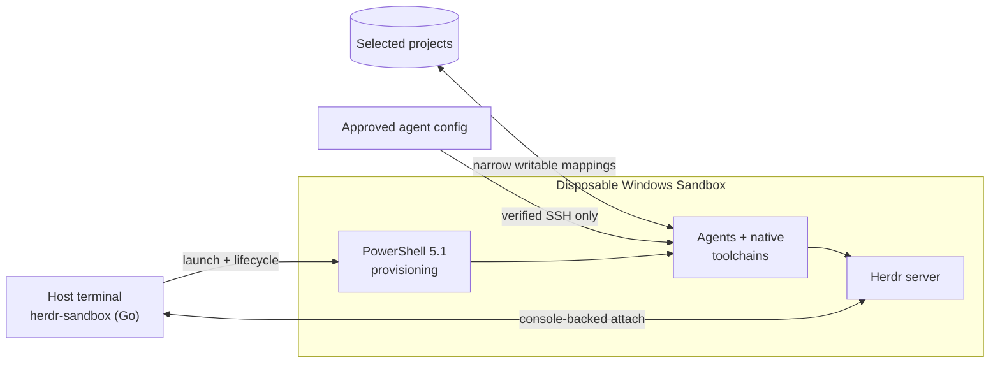

# herdr-sandbox

**Run coding agents in a disposable, native Windows development environment—without RDP, broad home-directory mounts, or host toolchain drift.**

[](https://github.com/hdosys/herdr-sandbox/actions/workflows/nightly.yml) [](https://github.com/hdosys/herdr-sandbox/actions/workflows/release.yml) [](go.mod)  [](LICENSE)

`herdr-sandbox` is a Windows-native counterpart to a [dev container](https://containers.dev/). It launches Windows Sandbox with only the selected projects, provisions native toolchains, transfers approved agent configuration over verified SSH, starts Herdr in the guest, and attaches the normal host terminal. Source edits persist on the host; guest tools and processes disappear with the Sandbox.

> [!NOTE]
> This README describes intended behavior, not a guarantee that every feature will be available or work on every Windows configuration. Host policy, networking, upstream tools, and platform changes can affect operation.

[How it works](#how-it-works) · [Engineering](#engineering-approach) · [Get started](#get-started) · [Commands](#commands) · [Configuration](#configuration) · [Security](#security-boundaries) · [Development](#development) · [License](#license)

## Key capabilities

- **Compiled Go control plane:** CLI parsing, strict configuration, process ownership, lifecycle, SSH, cleanup, and release packaging orchestration live in testable Go.
- **Native Windows isolation:** real Windows toolchains run inside Windows Sandbox instead of a compatibility layer.
- **Purpose-bounded PowerShell:** Windows PowerShell 5.1 is limited to Windows-specific provisioning, parser adapters, and installer orchestration; the host lifecycle remains Go.
- **Terminal-first workflow:** Herdr provides native attach and reattach from the host terminal; routine work does not require RDP.
- **Stable private reachability with Tailscale (experimental):** opt in to preserve one tagged guest identity, Tailscale IP, and MagicDNS name across fresh Sandboxes without exposing services to the public internet. [Setup and security boundaries](#stable-tailscale-tailnet-identity-experimental) remain explicit.
- **Agent-ready guests:** approved configuration for OpenCode, Claude Code, Codex, GitHub Copilot CLI, and Pi is synchronized over verified SSH.
- **Narrow persistence:** selected source trees and a verified package cache survive; the guest operating system, tools, and processes do not.
- **Fail-closed lifecycle:** exact process, path, launch-plan, and download identities are revalidated before reuse or cleanup.
- **Observable current path:** read-only planning, guided project initialization, retained-operation progress, rich status, and exact reattach use the same strict owners as provisioning.

## How it works



The host owns source, identity, configuration, cache, and bounded run evidence. The guest owns compilation, agent execution, and disposable runtime state.

## Engineering approach

`herdr-sandbox` is a compiled Go application. Go owns the host control plane and launch/lifecycle decisions; PowerShell is a deliberately narrow adapter for Windows-specific provisioning and installer work.

- Standard-library-first Go with no CGO or helper runtime.
- `context.Context` cancellation and bounded waits for subprocesses and long operations.
- Strict JSON, XML, status, process-identity, path, and release contracts at unsafe boundaries.
- Hidden host process trees, bounded diagnostics, atomic state publication, and fail-closed cleanup.
- Idempotent PowerShell 5.1 provisioning with parse checks and responsibility-specific read-back verification.
- Focused unit and boundary tests, `go vet`, stable artifact builds, and opt-in native Windows Sandbox acceptance gates.

> [!IMPORTANT]
> This is practical isolation, not a complete security boundary. Selected projects remain writable and guest networking is enabled. The disposable profile also intentionally restricts protections including Defender cloud features, SmartScreen, and automatic Windows/driver updates. Keep backups and normal supply-chain controls.

## Get started

### Prerequisites

- Windows 10 or Windows 11 with hardware virtualization and Windows Sandbox support.
- Windows PowerShell 5.1, OpenSSH Client, Windows Terminal, and internet access for cache misses.
- An existing remote-capable `herdr.exe` from the maintainer's [`herdr-win`](https://github.com/hdosys/herdr-win) fork on host `PATH`.
- Go 1.26.4 or newer only when building this repository from source.

If Windows Sandbox is not enabled, run the following from elevated Windows PowerShell and restart Windows:

```powershell
Enable-WindowsOptionalFeature -Online -FeatureName Containers-DisposableClientVM -All
```

Install `herdr.exe` from [`herdr-win`](https://github.com/hdosys/herdr-win) once and make it available on host `PATH`; `herdr-sandbox` never installs, updates, or replaces it. Before `up` or `attach` changes lifecycle state, Sandbox verifies the host command's remote interface and active runtime. Missing or unsupported builds point to `winget install --id hdosys.herdr-win --exact`. A fresh guest receives a digest-verified copy of that same active host runtime in a directory placed first on guest `PATH`, and the real SSH shell must resolve that copy before readiness. Herdr itself is never downloaded or installed inside the Sandbox.

### Install herdr-sandbox

The independent WinGet package IDs are fixed as `hdosys.herdr-sandbox` and `hdosys.herdr-win`. Once both community manifests are published, the intended installation command is:

```powershell
winget install hdosys.herdr-sandbox hdosys.herdr-win
```

> [!NOTE]
> The identifiers and command above are the committed distribution contract, but the manifests are not yet available in the public WinGet source. Neither package will bundle or declare a package dependency on the other.

Every [GitHub release](https://github.com/hdosys/herdr-sandbox/releases) provides a portable ZIP and a per-user installer with matching `.sha256` sidecars. Both distribute the same four application files: `herdr-sandbox.exe`, `base.ps1`, `stacks.ps1`, and `LICENSE`.

#### Portable ZIP

Download `herdr-sandbox_<version>_windows_amd64.zip` and its `.sha256`, verify the checksum, and extract all four files into one directory. Keep `base.ps1`, `stacks.ps1`, and `LICENSE` beside `herdr-sandbox.exe`, then run `.\herdr-sandbox.exe` or add that directory to your user `PATH`.

#### Build from source

From the repository root:

```powershell
go run ./cmd/task check
```

The checked build writes `build\bin\herdr-sandbox.exe` beside its required app-owned `base.ps1` and `stacks.ps1` assets and a copy of `LICENSE`. Use that executable directly or add `build\bin` to your user `PATH`.

#### Installer

Download `herdr-sandbox_<version>_windows_amd64_setup.exe` and its checksum. The installer runs per-user without administrator access, displays the Apache 2.0 license before installation, installs `LICENSE` beside the executable, and adds the application to Windows Installed Apps. Its finish page explains the terminal-first next steps and links to this setup and usage guide without launching a program or browser automatically.

> [!WARNING]
> The installer path is currently unsigned, so Windows may display a SmartScreen warning. Use it only after its SHA-256 matches the sidecar from the same release.

<details>
<summary><strong>Installer ownership and uninstall behavior</strong></summary>

Setup installs to `%LOCALAPPDATA%\Programs\Herdr Sandbox` and replaces the four packaged files as one set. If replacement fails, it attempts to restore the prior set and reports any incomplete rollback. It creates `%APPDATA%\herdr-sandbox\config.json` and `user.ps1` when each is absent, adds the install directory to the current user's effective `PATH` when needed, and registers **Herdr Sandbox** in Windows Installed Apps. Setup and upgrades never replace existing `config.json` or `user.ps1`. A matching `PATH` entry that existed before setup remains user-owned and survives uninstall.

Setup never bundles or installs Herdr/Herdr-Win, an updater, agent integrations, a runtime bundle, or Windows prerequisites. The two applications remain independent now and in their future WinGet manifests. Uninstall through **Settings → Apps → Installed apps → Herdr Sandbox → Uninstall**, or run `%LOCALAPPDATA%\Programs\Herdr Sandbox\uninstall.exe`. A successful uninstall first stops a proven app-owned Sandbox, then removes `%LOCALAPPDATA%\herdr-sandbox`, the managed SSH integration, the selected dedicated cache, the application files, registration, and installer-owned `PATH` entry. The **Also delete config.json and user.ps1** checkbox is off by default: leave it unchecked to preserve the entire `%APPDATA%\herdr-sandbox` configuration root for reinstall, or check it to remove that whole directory too. Project `.herdr-sandbox\provision.ps1` files and unrelated SSH/install-directory content are outside the uninstaller's ownership. Unsafe ownership or cleanup failure aborts before the application is removed.

</details>

### Launch your first project

Commands below assume `herdr-sandbox.exe` is on `PATH`; otherwise use its full path.

#### 1. Initialize a project profile

From the project root, select one or more stacks explicitly:

```powershell
herdr-sandbox init --stack go
```

Repeat `--stack` to combine `dotnet`, `go`, `node`, `python`, `rust`, and `zig`, or omit the flag for a guided prompt. `init` validates every selection before writing, never guesses from repository contents, and refuses to replace an existing profile or create a nested profile beneath an ancestor-owned project.

The Go command above creates `<project>\.herdr-sandbox\provision.ps1` with the equivalent direct-call profile:

```powershell
param(
    [Parameter(Mandatory = $true)]
    [string]$ProjectDirectory
)

$ErrorActionPreference = 'Stop'
Set-StrictMode -Version 2.0

Install-GoStack -ProjectDirectory $ProjectDirectory
```

The nearest ancestor containing this file becomes the active project. Profiles must be idempotent and fail fast.

#### 2. Inspect the effective plan

```powershell
herdr-sandbox plan
```

`plan` validates and prints the effective configuration, workspaces, global and project stacks, package owners, agent-sync choices, fixed Sandbox settings, and exact differences from a ready guest. It does not seed configuration, create app state, update host tools, download packages, consume a Tailscale key, or execute project scripts.

#### 3. Start from the project

```powershell
herdr-sandbox up
```

The visible PowerShell bootstrap console inside Windows Sandbox is intentional and requires no interaction. A successful run creates a usable guest workspace and attaches the host Herdr client—not merely SSH or an installed toolchain.

> [!NOTE]
> Automatic attach requires real console-backed stdin, stdout, and stderr. A redirected or headless caller is rejected before cleanup or provisioning instead of sending a TUI into logs. Use the intentional headless path:

```powershell
herdr-sandbox up --no-attach
```

#### 4. Reattach

After a normal detach, the guest Herdr server remains running:

```powershell
herdr-sandbox attach
```

The verified `herdr --remote sandbox` alias remains available for direct Herdr use.

Plain SSH is available for noninteractive diagnostics:

```powershell
ssh sandbox
```

## Commands

Command output is plain and redirect-safe: summaries use descriptive headings, indented fields, deterministic ordering, and one item per line instead of packed comma-separated lists. Results go to stdout, errors go to stderr, and no color or terminal UI framework is required.

| Command | Behavior |
| --- | --- |
| `herdr-sandbox plan` | Validates and prints the effective plan without seeding configuration or changing app, host-tool, or Sandbox state. |
| `herdr-sandbox init [--stack NAME]...` | Creates one direct-call project profile without guessing or replacing an existing/ancestor-owned profile. With no flag, prompts for stacks. |
| `herdr-sandbox up [--memory-mb MB] [--timeout DURATION] [--no-attach]` | Launches a fresh guest, or reprovisions when the exact ready app-owned launch plan still matches. It attaches unless `--no-attach` intentionally stops at terminal ready. There is no overall timeout by default. |
| `herdr-sandbox attach` | Reconstructs and verifies the exact ready app-owned connection, then starts the interactive Herdr client without reprovisioning. |
| `herdr-sandbox status` | Reports guest health, retained-operation state, safe workspace identities, versions, bounded timings/diagnostics, warnings, and the next action. It may clean only proven stale app-owned state. |
| `herdr-sandbox down` | Idempotently requests orderly close only for the exact revalidated app-owned Sandbox. It never force-kills any Sandbox; failed Tailscale preservation leaves an opted-in guest open. |
| `herdr-sandbox clean` | Explicitly runs the same strict inactive-run cleanup used automatically at startup. Exact active state, identities, user configuration, workspaces, unknown entries, and package caches are preserved. |

<details>
<summary><strong>Lifecycle and automatic cleanup</strong></summary>

After command syntax is validated, `up`, `status`, and `down` automatically remove validated inactive run directories; `clean` performs that same operation directly, not as an extra pre-step. A freely acquired lifecycle lock first marks any abandoned retained operation as interrupted. If process evidence proves that the Sandbox window was closed and no launcher/client remains, cleanup also clears the stale active record and app-owned SSH target so `up` can start cleanly. Changed, unmanaged, reparse-bearing, or uncertain ownership is reported without deleting status/failure evidence; `status` still prints the preserved state, while mutating commands fail closed. Help, `plan`, and invalid command lines do not run cleanup.

`up` refuses starting, failed, changed-plan, and unmanaged instances rather than guessing how to reuse them. Inspect with `status`, then use `down` when the recorded app-owned state can be safely closed.

Changing Tailscale identity selection, audio input/output, memory, cache, or workspace mappings requires `down` before the next `up`.

</details>

## Configuration

### Project profiles

Profiles call built-in stacks directly so the host can inspect requirements without executing project code:

| Development need | Direct profile call |
| --- | --- |
| Modern .NET 10 LTS SDK | `Install-DotNetStack` |
| Go | `Install-GoStack -ProjectDirectory $ProjectDirectory` |
| Node.js LTS | `Install-NodeStack` |
| Python (latest stable) | `Install-PythonStack` |
| Zig | `Install-ZigStack` |
| Rust with MSVC Build Tools | `Install-RustMSVCStack -ProjectDirectory $ProjectDirectory` |
| Cargo Nextest | `Install-CargoNextest` |
| Just | `Install-Just` |

Keep these calls direct—not behind aliases, dynamic invocation, or another dot-sourced file. Exact parameters and optional version selectors live in [`provisioning\stacks.ps1`](provisioning/stacks.ps1). With no version, a development stack resolves the latest stable release once and carries that concrete identity through cache, installation, and verification. An explicit version remains exact and fails instead of silently falling back. `Install-DotNetStack` owns only `Microsoft.DotNet.SDK.10`, the current modern LTS SDK family; it does not install .NET Framework, an older/preview SDK, Visual Studio, MSBuild compatibility, or `dotnet-install.ps1`. TypeScript, .NET target frameworks, and other application libraries remain project dependencies owned by their manifests and lockfiles. Release/bootstrap artifacts such as WinGet, OpenSSH, VC prerequisites, and the GeistMono payload remain application-release pins; Herdr instead comes from the verified active host runtime.

For a project-specific tool, add idempotent Windows PowerShell 5.1 to its profile. For a package needed in every guest, use [`wingetPackages.add`](#global-configuration). There is intentionally no plugin registry.

**Rust/MSVC note:** the first Rust-stack run may show Microsoft Visual Studio Installer on the host. The signed bootstrapper creates a verified Build Tools layout in the app-owned cache; it does not install Visual Studio or Rust on the host. The guest copies and installs from that layout.

### Global configuration

The first mutating `up` creates:

```text
%APPDATA%\herdr-sandbox\config.json
%APPDATA%\herdr-sandbox\user.ps1
```

`config.json` is strict JSON, so comments are not allowed. Example:

```json
{
  "cacheDirectory": "",
  "memoryMB": 32768,
  "audio": false,
  "audioInput": false,
  "tailscale": false,
  "codingAgentSync": {
    "opencode": true,
    "claudeCode": true,
    "codex": true,
    "githubCopilot": true,
    "pi": true
  },
  "wingetPackages": {
    "remove": [],
    "add": [],
    "versions": {}
  },
  "workspaceDiscovery": {
    "root": "D:\\Projects",
    "exclude": [
      "^(archive|scratch)$",
      "(?i)^temp-"
    ]
  },
  "workspaces": {
    "external": "E:\\Clients\\external"
  }
}
```

| Field | Meaning |
| --- | --- |
| `cacheDirectory` | Absolute dedicated Herdr Sandbox package/tool cache. Empty uses `<system-temp>\herdr-sandbox\cache`. It must not overlap a workspace or app run state; every uninstall recursively removes the entire selected cache, so never point it at a shared directory. |
| `memoryMB` | Default Sandbox memory; minimum 2048. `--memory-mb` overrides one run. |
| `audio` | Exact boolean audio-output opt-in. Omitted or `false` suppresses playback; only `true` leaves playback enabled. |
| `audioInput` | Exact boolean microphone-input opt-in. Omitted or `false` blocks host microphone sharing; only `true` enables Windows Sandbox audio input. |
| `tailscale` | Exact boolean opt-in for the stable tagged identity. Omitted or `false` leaves Tailscale install-only. |
| `codingAgentSync` | Five exact booleans; all default to `true`. Set one to `false` to skip that agent. |
| `workspaceDiscovery` | Optional direct-child project discovery with an absolute `root` and multiple `exclude` regular expressions. Empty or omitted `root` disables it. |
| `workspaces` | Additional unique workspace names mapped to absolute host project roots. |
| `wingetPackages.remove` | Known optional Base packages to omit. Core packages cannot be removed. |
| `wingetPackages.add` | Exact additional WinGet package IDs installed in every guest. |
| `wingetPackages.versions` | Exact versions for retained or added packages. Omitted versions resolve latest; unavailable exact versions fail. |

#### Audio and CPU policy

Both audio toggles default off. With `audio` and `audioInput` omitted or `false`, provisioning selects the Windows **No Sounds** scheme, mutes the default render endpoint at zero volume, and disables and stops the guest audio services with read-back verification. Ordinary applications therefore cannot restore playback just by changing their own volume.

Set `"audioInput": true` to share the host microphone with the guest, retain the shared audio services, and allow guest microphone capability consent. Capture and playback use the same Windows audio services, so when `audio` remains false, provisioning still selects **No Sounds** and mutes the render endpoint, but guest applications can unmute it. These controls are not an adversarial security boundary against administrator code inside the guest. Set `"audio": true` independently when playback is deliberate. Changing either toggle requires `herdr-sandbox down` before the next `up` can launch the new fixed plan.

Windows Sandbox exposes no supported per-instance CPU-priority setting, and Windows client Hyper-V scheduling does not support per-VM weights, caps, or reserves. The tool therefore does not offer an idle/low-priority option; changing the `WindowsSandbox.exe` launcher priority would not reliably control guest vCPU scheduling.

#### Agent packages

To install every coding agent that currently has a verified WinGet package, set `wingetPackages` to this copy-paste object:

```json
{
  "remove": [],
  "add": [
    "Anthropic.ClaudeCode",
    "OpenAI.Codex",
    "GitHub.Copilot"
  ],
  "versions": {}
}
```

OpenCode (`SST.opencode`) is already a Base default and must not be added again. Pi does not currently have a verified WinGet package; install it explicitly in the project profile that needs it. `codingAgentSync` controls configuration/authentication transfer only and does not install an agent.

#### Coding-agent sync

Configuration sync is default-on when these host surfaces exist:

| Agent | Configuration/authentication behavior |
| --- | --- |
| OpenCode | Copies approved config/data files and portable `auth.json`. |
| Claude Code | Copies approved `.claude` configuration and `.credentials.json`. |
| Codex | Copies approved `CODEX_HOME` content and file-mode credentials. Keyring credentials stay host-bound. |
| GitHub Copilot CLI | Copies approved config and reuses successfully imported GitHub CLI accounts. Native Credential Manager tokens stay host-bound. |
| Pi | Copies approved agent configuration and portable `auth.json`. |

The shared `%USERPROFILE%\.agents\skills` tree is copied once when Codex, Copilot, or Pi is enabled. Conversations, history, logs, caches, generated plugin/package state, project trust, private SSH/GPG keys, and unrelated home content are excluded. Missing host configuration is a clean no-op. This feature copies setup only; it does not install Claude Code, Codex, Copilot, or Pi.

#### Workspace discovery

`workspaceDiscovery` tests each Go/RE2 expression against the original direct-child directory name; matching is case-sensitive unless the expression uses `(?i)`, and any match excludes the directory. Discovery does not recurse or map the root itself. Every remaining child must contain `.herdr-sandbox\provision.ps1`; its workspace name is derived from the folder name. Use `workspaces` for projects outside the root or to give a discovered path an explicit name. The explicit entry wins when both select the same path. The active project is added automatically and deduplicated against the combined selection. The final maximum is 16 workspaces; paths must exist, must not overlap, and must not contain reparse aliases. Changing the discovered child set requires `down` before an existing guest can be replaced with the new mappings.

#### Global extension ownership

`base.ps1` and `stacks.ps1` are release-owned provider/adapter code and update with the application. The installer creates missing `config.json` and `user.ps1` defaults immediately; portable use creates the same defaults on its first mutating provisioning command. Put idempotent global PowerShell additions in the seeded-once `user.ps1`; it runs after app-owned helpers are ready and before project profiles. Keep package selection in `config.json` and project-specific behavior in the project profile. Do not store credentials or print secrets from `user.ps1`, because its immutable snapshot remains with active/uncertain run diagnostics until bounded automatic or explicit cleanup can safely remove that run.

Older releases seeded a user-owned `%APPDATA%\herdr-sandbox\base.ps1`. The new ownership model never overwrites or executes that file: `up` stops with migration instructions. Review it, move only deliberate global extension commands into `user.ps1`, move package choices into `config.json`, keep project tools in project profiles, archive the complete legacy Base under a non-reserved name, and retry.

#### Persistent host state

Persistent host state is split intentionally:

| Path | Contents |
| --- | --- |
| `%APPDATA%\herdr-sandbox` | User-owned global config and `user.ps1` extension. |
| `%LOCALAPPDATA%\herdr-sandbox\identity` | Host SSH identity and optional DPAPI-protected Tailscale identity. |
| `%LOCALAPPDATA%\herdr-sandbox\runs` | Per-run status, diagnostics, host-owned retained-operation state, SSH material, and `.wsb` files. Do not edit an active run. |
| `%LOCALAPPDATA%\herdr-sandbox\ssh\config` | App-owned `Host sandbox` target for the current guest; removed automatically only when no Sandbox is proven to remain. |
| `<system-temp>\herdr-sandbox\cache` | Default persistent package/tool cache. |

## Security boundaries

- Writable host mappings are limited to selected project roots, the explicit package/tool cache, and bounded per-run status; networking remains enabled.
- The host home directory, general AppData, unrelated repositories, and private SSH/GPG keys are never mapped; only the app-owned public SSH key enters the guest.
- Approved GitHub CLI and coding-agent credentials travel only over verified SSH and never enter persistent run input or logs. Machine-bound credentials require a guest login.
- Tailscale auth-key and state bytes never enter mappings, status, diagnostics, command lines, or package cache.
- Guest OpenCode managed policy resolves every permission to `allow`; host OpenCode policy is unchanged. Treat guest agents as fully authorized inside the Sandbox and mapped projects.
- The reviewed disposable-guest privacy profile intentionally restricts Defender cloud/security features, SmartScreen, automatic updates, telemetry, and related services. It is not a hardened production workstation profile.
- Downloads and cache hits are validated against strict versions, metadata, hashes, signatures, or package identity as applicable.
- Host Rust tooling is forbidden. Rust installation, builds, and tests belong only in the verified guest or GitHub Actions.
- Lifecycle commands revalidate exact app-owned process/path identity and refuse unrelated, changed, or reparse-bearing state.

## Stable Tailscale tailnet identity (experimental)

> [!CAUTION]
> The required two-fresh-Sandbox identity and peer-connectivity acceptance gate remains open. Use this opt-in only with a tailnet prepared for a dedicated tagged device.

`herdr-sandbox` joins an existing user-owned tailnet; it does not create the tailnet or manage its policy. The stable address lets an approved phone, tablet, or another computer reach services in the running Sandbox without publishing them to the internet. The web admin console remains available. Installation only suppresses automatically opening the guest tray app; noninteractive DPAPI protection does not disable the Tailscale UI. Leave `"tailscale": false` if you prefer a manually managed disposable login; that identity will not be preserved.

Tailscale supplies the private network path, not a terminal UI or automatic service authorization. To control the guest from a phone, install Tailscale plus a compatible SSH/terminal client on the phone and deliberately authorize that client's public key in guest provisioning—or expose another authenticated guest service. The default OpenSSH endpoint authorizes only the app-owned host-side client identity; never copy that private key to the phone.

<details>
<summary><strong>First-time tailnet and enrollment setup</strong></summary>

### 1. Prepare the tailnet

In the [Tailscale admin console](https://login.tailscale.com/admin):

1. Create or open the target tailnet and enable MagicDNS.
2. Add a dedicated tag with least-privilege access.
3. Merge policy entries such as the following; do not replace unrelated policy:

```json
{
  "tagOwners": {
    "tag:herdr-sandbox": ["autogroup:admin"]
  },
  "acls": [
    {
      "action": "accept",
      "src": ["autogroup:admin"],
      "dst": ["tag:herdr-sandbox:22"]
    }
  ]
}
```

Replace the source and ports with the users, groups, and services actually required. See Tailscale's [tag](https://tailscale.com/docs/features/tags) and [access-control](https://tailscale.com/docs/features/access-control) documentation.

### 2. Create the one-time key

Create one auth key on the admin console's Keys page:

- **Reusable:** off
- **Ephemeral:** off
- **Pre-approved/pre-authorized:** on when device approval is enabled
- **Tags:** `tag:herdr-sandbox`

If Tailnet Lock is enabled, sign the key from an existing trusted node first. Never put it in `config.json`, provisioning, shell history, or an argument to `herdr-sandbox up` or `tailscale up`.

### 3. Enable and enroll

Set `"tailscale": true` in `%APPDATA%\herdr-sandbox\config.json`. A minimal `{ "tailscale": true }` file is valid; before the first-ever `up`, create that file with an editor. Keep `Tailscale.Tailscale` in the Base package plan.

From the intended project directory, pass the key once without putting it in command history:

```powershell
$herdrSandbox = 'D:\path\to\herdr-sandbox\build\bin\herdr-sandbox.exe'
$keyPointer = [Runtime.InteropServices.Marshal]::SecureStringToBSTR(
    (Read-Host 'One-off tagged Tailscale auth key' -AsSecureString)
)
try {
    $env:HERDR_SANDBOX_TAILSCALE_AUTH_KEY = [Runtime.InteropServices.Marshal]::PtrToStringBSTR($keyPointer)
    & $herdrSandbox up
} finally {
    Remove-Item Env:HERDR_SANDBOX_TAILSCALE_AUTH_KEY -ErrorAction SilentlyContinue
    [Runtime.InteropServices.Marshal]::ZeroFreeBSTR($keyPointer)
}
```

The CLI removes its inherited environment copy before launching children, enrolls fixed hostname `herdr-sandbox`, verifies the tagged identity, and stores the complete node state only as current-user DPAPI ciphertext. Confirm exactly one tagged device in the admin console and verify the private route from the phone or another intended peer with `tailscale ping herdr-sandbox`; service login still requires the separately authorized credential described above.

### 4. Later Sandboxes

Do not supply the auth key again. `down` captures and verifies current state before closing; the next fresh `up` restores it over verified SSH. Device ID, node key, IPv4, MagicDNS, hostname, tags, and Windows Sandbox user SID must remain exact or the workflow fails closed.

Keep node-key expiry disabled. Do not delete the tailnet device or `%LOCALAPPDATA%\herdr-sandbox\identity\tailscale-identity.json` while expecting restoration. The protected identity is bound to the current Windows host user and is not a portable backup.

</details>

## Troubleshooting

Start with `herdr-sandbox status`; it never changes a running Sandbox and performs only the same bounded stale-state cleanup as other valid commands.

| Symptom | Action |
| --- | --- |
| Windows Sandbox is unavailable | Enable `Containers-DisposableClientVM` from elevated Windows PowerShell, restart Windows, and confirm hardware virtualization is enabled. |
| `up` refuses an existing Sandbox | A ready exact guest is reused automatically. A normally closed window is cleaned on the next valid command. For failed, changed-plan, unmanaged, or ownership-uncertain state, inspect the reported evidence and use `herdr-sandbox down` only when it identifies the app-owned instance. |
| Automatic attach is unavailable in a headless process | Provision intentionally with `herdr-sandbox up --no-attach`, then open a real terminal and run `herdr-sandbox attach`; a verified ready guest remains reusable. |
| The guest has no playback audio | Audio output is off by default. Set `"audio": true` in `config.json`, run `herdr-sandbox down`, then start a fresh guest with `up`. This does not enable microphone input. |
| The guest cannot use the microphone | Microphone input is off by default. Set `"audioInput": true` in `config.json`, run `herdr-sandbox down`, then start a fresh guest with `up`. Host microphone permissions or policy can still block sharing. |
| `ssh sandbox` no longer connects | Run `herdr-sandbox status`. If no Sandbox remains, startup cleanup removes the stale target and reports `stopped`; run `up` to create the next verified target. Ownership uncertainty is preserved and reported instead of guessed. |
| Legacy global Base is refused | Preserve `%APPDATA%\herdr-sandbox\base.ps1`, move only deliberate additions to `user.ps1`/config/project ownership, archive the legacy file under a non-reserved name, and retry. |
| Initial provisioning is slow | The first run may download WinGet, OpenSSH, selected SDKs such as modern .NET or Rust, and the Visual Studio layout required only by Rust/MSVC. Herdr is copied from the host and does not use the download cache. Confirm that the cache is writable and does not overlap a workspace or run state. |
| Stable Tailscale enrollment is refused | Confirm exact `true`, the retained Tailscale package, and a current one-time non-ephemeral pre-approved tagged key. Restoration refuses missing, corrupt, differently DPAPI-bound, untagged, or identity-mismatched state. |
| Old diagnostics consume space | `up`, `status`, and `down` remove validated inactive run workspaces automatically; `clean` invokes the same cleanup explicitly once. Active/uncertain evidence and the persistent cache remain preserved. |

## Development

Repository tasks:

```powershell
go run ./cmd/task fmt
go run ./cmd/task test
go run ./cmd/task build
go run ./cmd/task check
go run ./cmd/task package v0.0.0
```

`check` covers Go formatting, Windows PowerShell 5.1 parsing, all Go tests, `go vet`, and the stable `build\bin` artifact. `package` requires the pinned NSIS 3.12 compiler and writes the installer, ZIP, and both checksum files under `build\dist`; it never installs the resulting package. Repository-owned provisioning and installer helper scripts run exclusively under Windows PowerShell 5.1; installed PowerShell 7 is interactive guest tooling.

## License

`herdr-sandbox` is licensed under the [Apache License, Version 2.0](LICENSE) and is provided on an **"AS IS" BASIS, WITHOUT WARRANTIES OR CONDITIONS OF ANY KIND**. See the license for the governing terms, including its warranty disclaimer and limitation of liability.

## Documentation

- Stable user-visible behavior: [`PRODUCT.md`](PRODUCT.md)
- Technical boundaries: [`ARCHITECTURE.md`](ARCHITECTURE.md)
- Open work: [`BACKLOG.md`](BACKLOG.md)
- Project-specific agent/repository rules: [`AGENTS.md`](AGENTS.md)
