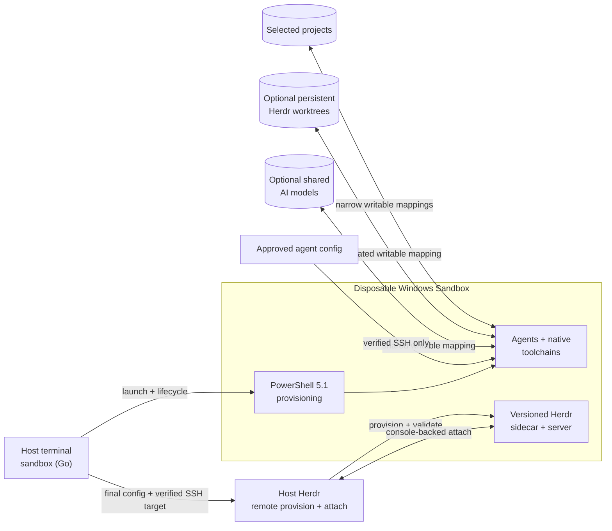

# Herdr Sandbox

**Run coding agents in a disposable, native Windows development environment without RDP, broad home-directory mounts, or host toolchain drift.**

[](https://github.com/hdosys/herdr-sandbox/actions/workflows/nightly.yml) [](https://github.com/hdosys/herdr-sandbox/actions/workflows/release.yml) [](go.mod)  [](LICENSE)

Herdr Sandbox is a Windows-native counterpart to a [dev container](https://containers.dev/). Run `sandbox up` from a project and continue working in the normal host terminal while coding agents and native Windows toolchains run inside Windows Sandbox. Selected source folders remain on the host; guest tools and processes disappear when the Sandbox closes.

[Get started](#get-started) · [Configuration](#configuration) · [Commands](#commands) · [Stacks](#supported-stacks) · [Troubleshooting](#troubleshooting) · [Engineering](#engineering-approach) · [How it works](#how-it-works) · [Security](#security-boundaries) · [Optional workflows](#optional-workflows) · [Development](#development) · [Docs](#documentation)

## See it in action

https://github.com/user-attachments/assets/b6c02367-683b-4a1f-94e6-b662149d89d9

Detach and reconnect to the same OpenCode session through Herdr's managed Windows Sandbox connection, without switching to an RDP workflow.

## What you get

- **Confidence in real Windows behavior:** compile, test, package, and automate GUI applications in Windows Sandbox instead of a compatibility layer.
- **Your normal terminal:** Herdr attaches from the host, so routine work does not require RDP or a second desktop workflow.
- **Repeatable project setup:** select composable tool stacks or keep an idempotent PowerShell profile with the project.
- **Fast iteration:** reuse and reprovision a compatible ready guest instead of rebuilding it for every change.
- **Deliberate persistence:** source, optional worktree and shared model roots, approved agent configuration, and a verified package cache survive; guest tools and processes do not.
- **Mobile access to agents:** use Herdr from a phone or tablet over Tailscale to review notifications, answer agent questions, and run project commands.
- **Explicit opt-ins:** browser automation, TradingView, audio, and microphone remain off unless selected.

## Engineering approach

- **One control plane:** standard-library-first Go owns CLI, configuration, lifecycle, SSH, cleanup, and packaging. PowerShell 5.1 is limited to Windows provisioning.
- **One owner per responsibility:** state, process identity, project profiles, installer behavior, and external integrations have explicit boundaries rather than parallel implementations.
- **Fail-closed lifecycle handling:** cancellation, bounded process trees, atomic state publication, strict parsing, and ownership checks prevent uncertain cleanup or attachment.
- **Reproducible provisioning:** versions, package identity, hashes, signatures, and realized state are checked where the external boundary supports them. Repeated runs converge without duplicating work.
- **Real release evidence:** fast tests and static checks cover the control plane; release checks compile and validate the real installer, while a real Windows Sandbox run exercises provisioning, SSH, and attach.

## How it works



The host keeps source, identity, configuration, cache, and diagnostics. The guest owns compilation, agent execution, and disposable runtime state. Go makes lifecycle decisions; PowerShell performs Windows-specific provisioning.

> [!IMPORTANT]
> Windows Sandbox separates this work from the normal Windows installation, but selected projects remain writable and guest administrators can access explicitly transferred credentials. Networking is enabled. Keep backups and normal supply-chain controls; see [Security boundaries](#security-boundaries) before using untrusted code.

## Get started

### Prerequisites

- Windows 10 or Windows 11 with hardware virtualization and Windows Sandbox support.
- Windows Terminal, the Windows OpenSSH Client (`ssh.exe` on host `PATH`), and internet access for cache misses.
- [Herdr Win](https://github.com/hdosys/herdr-win) on host `PATH`.
- Go 1.26.7 or newer only when building this repository from source.

If Windows Sandbox is not enabled, run the following from elevated Windows PowerShell and restart Windows:

```powershell
Enable-WindowsOptionalFeature -Online -FeatureName Containers-DisposableClientVM -All
```

### Install with WinGet (recommended)

Herdr Sandbox requires Herdr Win. Install both packages with:

```powershell
winget install hdosys.herdr-win hdosys.herdr-sandbox
```

Update both:

```powershell
winget upgrade hdosys.herdr-win hdosys.herdr-sandbox
```

Herdr Win provides the Windows server and remote provisioning used by Herdr
Sandbox. It remains a separate package.

### Direct installer alternative

Download and verify the latest [Herdr Win](https://github.com/hdosys/herdr-win/releases/latest)
and [Herdr Sandbox](https://github.com/hdosys/herdr-sandbox/releases/latest)
setups, then install Herdr Win first. GitHub displays the SHA-256 digest for each
release asset.

### Verify installation

Open a new terminal and confirm:

```powershell
herdr --version
sandbox --version
```

The Herdr result must contain the exact `herdr-win` marker.

> [!WARNING]
> The Herdr Win and Herdr Sandbox installers are currently unsigned. For direct
> downloads, use the linked releases and verify their GitHub SHA-256 digests.

<details>
<summary><strong>Installer and uninstall behavior</strong></summary>

- Setup owns the fixed `%LOCALAPPDATA%\Programs\Herdr Sandbox` binary directory and replaces that complete directory during upgrade.
- `%APPDATA%\herdr-sandbox\config.json` and `user.ps1` are created only when absent and survive upgrades and normal uninstall. Select **Also delete config.json and user.ps1** only when that removal is intended.
- Files manually placed inside the installed binary directory are removed during upgrade or uninstall; projects, Herdr-Win, and unrelated user data remain outside installer ownership.
- Remove an older-format installation with its matching uninstaller before installing the current release. The current setup deliberately does not migrate historical installer formats.
- Uninstall from **Settings → Apps → Installed apps**. A running Windows Sandbox is preserved and becomes unmanaged rather than being closed by setup.

</details>

<details>
<summary><strong>Portable ZIP and source build</strong></summary>

#### Portable ZIP

Download `herdr-sandbox_<version>_windows_amd64.zip`, verify its GitHub SHA-256 asset digest, and extract all four files into one directory. Keep the three support files beside `sandbox.exe`, then run `.\sandbox.exe` or add that directory to user `PATH`.

#### Build from source

From the repository root:

```powershell
go run ./cmd/task verify
```

The checked build writes the same four files to `build\bin`. Use that executable directly or add the directory to user `PATH`.

</details>

### Review global configuration

Before the first `up`, open the user-owned global configuration:

```powershell
sandbox config
```

Review memory, agent configuration sync, optional packages, and host folder
mappings before exposing them to the guest. The command creates `config.json`
only when absent. See [Configuration](#configuration) for a practical example
and the complete field reference.

### Launch your first project

From the project root, choose a stack, inspect the plan, and start:

```powershell
sandbox init --stack go
sandbox plan
sandbox up
```

Omit `--stack` for a prompt or repeat it to combine compatible entries from
[Supported stacks](#supported-stacks). `init` writes
`.herdr-sandbox\provision.ps1` without replacing an existing profile. `plan` is
read-only. `up` provisions the guest and attaches Herdr in the normal host
terminal; the visible Sandbox bootstrap console needs no input.

After detaching, the guest stays ready:

```powershell
sandbox status
sandbox attach
sandbox down
```

Use `sandbox up --no-attach` from a headless caller, then attach later from a real
terminal. Plain `ssh sandbox` remains available for diagnostics.

## Configuration

Project profiles own per-project tools. `config.json` and `user.ps1` own global
choices. Setup never overwrites either user-owned file.

### Global configuration

Open the user-owned configuration:

```powershell
sandbox config
```

The command creates `config.json` only when absent. Setup, portable first use, and
`sandbox config` refresh the app-owned `config.sample.json` and
`config.schema.json` references without replacing user configuration. Global
PowerShell additions belong in `user.ps1`:

```text
%APPDATA%\herdr-sandbox\config.json
%APPDATA%\herdr-sandbox\config.sample.json
%APPDATA%\herdr-sandbox\config.schema.json
%APPDATA%\herdr-sandbox\user.ps1
```

New configurations include `"$schema": "./config.schema.json"`, so compatible
editors discover the adjacent schema without a network request. Existing
configurations are never rewritten. The schema checks JSON structure only;
`sandbox plan` remains authoritative for paths, overlaps, package policy, and
credentials.

`config.json` is strict JSON. A complete practical example:

```json
{
  "$schema": "./config.schema.json",
  "cacheDirectory": "D:\\HerdrSandboxCache",
  "worktreeDirectory": "D:\\HerdrWorktrees",
  "modelsDirectory": "D:\\Models",
  "memoryMB": 32768,
  "audio": false,
  "audioInput": false,
  "tailscale": false,
  "mobileSSHAuthorizedKeys": [],
  "configurationSync": {
    "pullHostGitRepositoriesOnUp": false,
    "pullHostGitRepositoriesOnDown": false
  },
  "codingAgentSync": {
    "opencode": true,
    "claudeCode": true,
    "codex": true,
    "githubCopilot": true,
    "pi": true
  },
  "credentialSync": {
    "opencode": false,
    "claudeCode": false,
    "codex": false,
    "githubCLI": false,
    "pi": false,
    "tradingView": false
  },
  "workspaces": {
    "project": "D:\\Projects\\project"
  },
  "mounts": {
    "docs": {
      "path": "D:\\Shared\\docs",
      "readOnly": true
    },
    "scratch": {
      "path": "D:\\Shared\\scratch",
      "readOnly": false
    }
  },
  "workspaceDiscovery": {
    "root": "D:\\Projects",
    "exclude": [
      "^archive$"
    ]
  },
  "wingetPackages": {
    "remove": [],
    "add": [
      "SST.opencode",
      "Anthropic.ClaudeCode",
      "OpenAI.Codex",
      "GitHub.Copilot"
    ],
    "versions": {}
  }
}
```

Replace paths with existing folders. User-chosen keys such as `client` and `docs`
become the final guest folder names.

Review the effective configuration and resolved tool versions with `sandbox plan`
before `up`. Package changes can apply to a compatible ready guest without
replacing it.

<details>
<summary><strong>Complete config.json field reference</strong></summary>

Workspace and mount names use letters, numbers, `.`, `_`, or `-`, start with a
letter or number, and are at most 64 characters.

| Field | Value and effect |
| --- | --- |
| `$schema` | Optional editor hint. When present, it must be `./config.schema.json`. |
| `cacheDirectory` | Absolute dedicated cache root, created when absent. `""` uses task-owned temporary cache state. Never point it at shared data. |
| `worktreeDirectory` | Existing dedicated host directory mapped read-write to `C:\Worktrees`. `""` disables it. |
| `modelsDirectory` | Existing dedicated host directory mapped read-write to `C:\Models`. `""` disables it. |
| `memoryMB` | Integer Sandbox memory limit in MiB, minimum `2048`. `--memory-mb` overrides one run. |
| `audio` | Boolean enabling guest audio output. |
| `audioInput` | Boolean enabling guest microphone input. |
| `tailscale` | Boolean enabling Herdr's stable tagged Tailscale identity. |
| `mobileSSHAuthorizedKeys` | Array of at most eight unique device-owned Ed25519 public keys. A nonempty array requires `tailscale: true`. |
| `configurationSync.pullHostGitRepositoriesOnUp` | Opt-in boolean allowing fast-forward-only pulls of detected host Git config repositories during `up`. Defaults to `false`. |
| `configurationSync.pullHostGitRepositoriesOnDown` | Opt-in boolean allowing the same pull policy during `down`. Defaults to `false`. |
| `codingAgentSync.opencode` | Boolean streaming OpenCode configuration into the guest. Defaults to `true`. |
| `codingAgentSync.claudeCode` | Boolean streaming Claude Code configuration into the guest. Defaults to `true`. |
| `codingAgentSync.codex` | Boolean streaming Codex configuration into the guest. Defaults to `true`. |
| `codingAgentSync.githubCopilot` | Boolean streaming GitHub Copilot configuration into the guest. Defaults to `true`. |
| `codingAgentSync.pi` | Boolean streaming Pi configuration into the guest. Defaults to `true`. |
| `credentialSync.opencode` | Boolean streaming an existing OpenCode API credential. |
| `credentialSync.claudeCode` | Boolean streaming an existing Claude Code credential. |
| `credentialSync.codex` | Boolean streaming an existing Codex credential. |
| `credentialSync.githubCLI` | Boolean streaming an existing GitHub CLI credential. |
| `credentialSync.pi` | Boolean streaming an existing Pi credential. |
| `credentialSync.tradingView` | Boolean streaming existing TradingView session cookies. |
| `workspaces.<name>` | Existing absolute project-directory string mapped read-write to `C:\Workspaces\<name>`. |
| `mounts.<name>.path` | Existing absolute generic-directory string mapped to `C:\Mounts\<name>`. |
| `mounts.<name>.readOnly` | Required boolean. `true` blocks guest writes through that mapping. |
| `workspaceDiscovery.root` | Existing parent directory whose direct child directories become workspaces. `""` disables discovery. |
| `workspaceDiscovery.exclude` | Array of at most 64 unique Go RE2 patterns matched against direct child names. |
| `wingetPackages.remove` | Array of supported Base package IDs to remove from the default set. |
| `wingetPackages.add` | Array of supported Base package IDs to add. It defaults to the four coding-agent packages shown above. |
| `wingetPackages.versions.<packageID>` | Exact WinGet version string for a selected package. Omit it for newest-stable resolution. |

</details>

### Project profiles

`sandbox init` writes direct calls into `.herdr-sandbox\provision.ps1` so
`sandbox plan` can inspect requirements without executing project code. Advanced
profiles may call the supported functions in
[`provisioning\stacks.ps1`](provisioning/stacks.ps1) and add idempotent Windows
PowerShell 5.1 for project-specific tools. Keep application dependencies and
lockfiles in their normal project owners.

The first C/C++, Rust/MSVC, or Handy run may briefly show Microsoft Visual Studio
Installer while Herdr Sandbox prepares a verified Build Tools layout in its cache.
Nothing is installed into the host development environment.

<details>
<summary><strong>Agent configuration sync</strong></summary>

Configuration transfer is enabled by default for OpenCode, Claude Code, Codex,
GitHub Copilot CLI, and Pi. Set an individual `codingAgentSync` field to `false`
to disable that source. Credential transfer is a separate opt-in through
`credentialSync`. Missing host
credentials leave the guest unchanged. Turning an entry off stops later
transfers but does not revoke a credential already present in a retained guest;
closing the Sandbox remains the cleanup boundary. GitHub CLI `config.yml` and
TradingView stack/privacy settings remain usable without transferring accounts
or session cookies. Review these
choices before the first `up`. Approved files travel over verified SSH; a
Git-backed configuration root also transfers repository metadata and object
history, which may contain old secrets. Disable any root whose complete history is
not safe for the guest. Private SSH and GPG keys, conversations, logs, caches, and
machine-bound credentials stay on the host. Agent installation remains a separate
`wingetPackages.add` choice. `sandbox plan` lists configuration and credential
selections separately.

```json
{
  "credentialSync": {
    "opencode": false,
    "claudeCode": false,
    "codex": false,
    "githubCLI": false,
    "pi": false,
    "tradingView": false
  }
}
```

When enabled, registered configuration repositories fast-forward before `up` and
after `down`. Local edits are never rebased, stashed, or overwritten; divergence
and authentication failures are reported for the user to resolve.

</details>

<details>
<summary><strong>Mappings and optional settings</strong></summary>

- Prefer read-only `mounts` for reference material. Writable mappings expose host
  data to every guest administrator process.
- `modelsDirectory` must be a dedicated existing AI-model folder. Every guest
  administrator can read and modify it; Herdr Sandbox verifies its own VoxCPM2
  files again before activation.
- `workspaceDiscovery` selects only direct child directories and supports explicit
  exclusion patterns. The nearest profiled project is included automatically.
- Audio output and microphone input are separate opt-ins. Changing either requires
  a fresh guest.
- Add `KhronosGroup.VulkanRT` only for the experimental vGPU-backed runtime path.
  It does not install a Vulkan SDK or host driver.

</details>

<details>
<summary><strong>Persistent Herdr worktrees</strong></summary>

Set `worktreeDirectory` to an existing dedicated host folder when Herdr-created
linked checkouts should survive fresh Sandboxes. Use Herdr for their complete
lifecycle:

| Goal | Command | Result |
| --- | --- | --- |
| Create and open | `herdr worktree create --cwd "<main-checkout>" --branch "<branch>" --base "<ref>"` | Creates a linked checkout and opens its workspace. |
| Discover | `herdr worktree list --cwd "<main-checkout>" --json` | Lists checkouts and open workspace IDs. |
| Reopen | `herdr worktree open --cwd "<main-checkout>" --path "<checkout>"` | Reopens an existing checkout after a fresh Sandbox. |
| Remove | `herdr worktree remove --workspace "<workspace-id>"` | Removes the checkout but keeps its branch. |

These are guest-native linked worktrees. Keep the main workspace at the same guest
path, use Herdr rather than host Git for lifecycle operations, and remove linked
worktrees before removing their main workspace. `sandbox clean` and uninstall
preserve the dedicated root.

</details>

## Commands

Command output is plain, deterministic, and redirect-safe. Results go to stdout
and errors go to stderr.

| Command | Behavior |
| --- | --- |
| `sandbox config` | Creates and opens user configuration without replacing an existing file. |
| `sandbox version` or `sandbox --version` | Prints the release, sortable UTC build freshness, and abbreviated source revision. |
| `sandbox plan` | Shows the validated plan and ready-guest differences without changing state. |
| `sandbox init [--stack NAME]...` | Creates a project profile, interactively when no stack is supplied. |
| `sandbox up [--memory-mb MB] [--timeout DURATION] [--no-attach]` | Starts or reprovisions a compatible guest and normally attaches. |
| `sandbox pull-host-config` | Fast-forwards explicitly registered configuration repositories without touching a guest. |
| `sandbox attach` | Attaches to a ready Herdr Sandbox guest without reprovisioning. |
| `sandbox status` | Reports health, progress, diagnostics, and the next action. Returns zero only when the state is `ready`. |
| `sandbox mobile` | Prints the mobile SSH profile and secret-free QR code. |
| `sandbox down` | Stops only the guest started by Herdr Sandbox and preserves opted-in Tailscale state. |
| `sandbox clean` | Removes inactive run data only after verifying it is safe to delete. |

Lifecycle commands remove stale data only after verifying that no owned Sandbox
process still uses it. Changed or uncertain state is preserved and reported.
Settings that change host mappings or the isolation boundary require
`sandbox down` before the next `up`. `sandbox up` has a four-hour
launch-to-terminal-ready timeout by default. A positive `--timeout DURATION`
replaces it for one run, while caller cancellation can still stop the operation
sooner.

## Supported stacks

Start with the one stack that matches the project. Repeat `--stack` only to combine
compatible entries. The exclusive `all` selection installs every generic stack
and is intended for exhaustive environments rather than the usual first run.

<details>
<summary><strong>Complete built-in stack catalog</strong></summary>

| Selection | Guest tooling |
| --- | --- |
| `all` | Every generic built-in: Android, Audio, Bun, Cargo Nextest, C/C++, .NET, Go, HyperFrames, Java, Just, Node/Playwright, NSIS, Nushell, Playwright CLI, Python AI with current stable Python and uv, Rust/MSVC, TradingView, and Zig; checkout-specific Handy and Herdr remain separate |
| `android` | Current Android SDK command-line tools, Platform Tools/ADB, and the shared current stable Microsoft OpenJDK stack |
| `audio` | REAPER plus AudioGridder Server and clients, with production VST execution inside the Sandbox |
| `cpp` | C and C++ with current stable Visual Studio Build Tools, Windows 11 SDK, and CMake |
| `dotnet` | Current stable .NET SDK family |
| `go` | Go |
| `hyperframes` | Node.js 22+, full FFmpeg/FFprobe, managed Chrome Headless Shell, and manually activated HyperFrames skills for OpenCode |
| `java` | Current stable Microsoft OpenJDK family |
| `node` | Node.js LTS, Playwright, and Chromium |
| `nsis` | NSIS compiler for building Windows installers |
| `nushell` | Latest stable Nushell command-line shell |
| `playwright-cli` | Playwright CLI without a bundled browser |
| `python` | Latest stable Python |
| `python-ai` | Current stable Python and uv for CPU inference, notebooks, and API-based projects |
| `rust` | Rust with MSVC Build Tools |
| `tradingview` | TradingView Desktop and TVControl; host login transfer requires `credentialSync.tradingView` |
| `zig` | Zig |

Project profiles may also call direct Bun, Cargo Nextest, Just, and uv helpers.
The `all` expansion uses the Python AI composition as its single Python and uv
owner, avoiding redundant standalone calls.
Omitted external-tool versions resolve to the current official stable release at
provisioning time. Explicit project versions remain exact and never fall back.

</details>

<details>
<summary><strong>Checkout-specific Handy and Herdr shortcuts</strong></summary>

These repository-specific shortcuts remain outside `all`:

| Shortcut | Intended setup |
| --- | --- |
| `handy` | The current Handy Windows checkout, including Bun, Rust/MSVC, CMake, Vulkan SDK, and WebView2 |
| `herdr` | Herdr and Herdr-Win checkouts, including Python, Rust/MSVC, Zig, Bun, Cargo Nextest, Just, and Git for Windows `sh` |

Dependencies and application commands remain project-owned. `sandbox plan`
expands each composition without executing the profile.
If custom project provisioning fails, the error names the workspace and its
`.herdr-sandbox\provision.ps1` profile before preserving the original cause.

</details>

## Security boundaries

See [`SECURITY.md`](SECURITY.md) for vulnerability reporting, the complete threat
model, and practical guidance for credential-free or externally network-restricted
use.

Guest processes have administrator access inside Windows Sandbox. Only select host folders deliberately, prefer read-only mounts, and treat every credential copied into the network-enabled guest as accessible to its workloads.

- Writable host access is limited to selected projects, explicit writable mounts,
  the optional worktree and shared model roots, cache, and run status.
- The host home root, general AppData, unselected repositories, and private SSH or
  GPG keys are never mapped.
- Approved portable credentials travel only over verified SSH and never enter
  persistent run input or logs. Machine-bound credentials stay on the host.
- Downloads and cache hits are checked against package identity, versions, hashes,
  signatures, or metadata as applicable.
- Lifecycle commands revalidate process and path ownership before attachment or
  cleanup. Uncertain state is preserved.
- The disposable guest profile reduces some Windows protections and is not a
  hardened production workstation.

## Troubleshooting

Start with `sandbox status`; it preserves a running guest, removes stale data only
when it is safe, and reports the next action.

| Symptom | Action |
| --- | --- |
| Windows Sandbox is unavailable | Enable `Containers-DisposableClientVM` from elevated Windows PowerShell, restart Windows, and confirm hardware virtualization is enabled. |
| `up` refuses an existing Sandbox | Run `sandbox status` and follow its next action. Use `down` only when it identifies the app-owned guest. |
| Automatic attach is unavailable in a headless process | Run `sandbox up --no-attach`, then use `sandbox attach` from a real terminal. |
| `ssh sandbox` no longer connects | Run `sandbox status`. If the guest is gone, run `sandbox up` to create a verified target. |
| Legacy global Base is refused | Preserve `%APPDATA%\herdr-sandbox\base.ps1`, move only deliberate additions to `user.ps1`/config/project ownership, archive the legacy file under a non-reserved name, and retry. |
| Host configuration pull fails | Resolve the named repository's local state, upstream, authentication, network, or timeout problem, or disable the relevant automatic hook. |
| Guest Herdr provisioning fails | Confirm current Herdr-Win, host `ssh.exe`, and `ssh sandbox`, then inspect the failed phase with `sandbox status`. |
| Initial provisioning is slow | The first run downloads selected toolchains; C/C++, Rust/MSVC, and Handy also prepare a Visual Studio layout. Later runs reuse the cache. |

<details>
<summary><strong>Audio, mobile, and Tailscale troubleshooting</strong></summary>

| Symptom | Action |
| --- | --- |
| Audio or microphone is unavailable | Set `audio` or `audioInput` to `true`, run `sandbox down`, then start a fresh guest. |
| The host AudioGridder client does not find the Sandbox server | Start **AudioGridder Server** in the guest, use `<Guest IP>:0` from `sandbox status`, and confirm the VST was installed through guest project or user provisioning. |
| Mobile access is not ready | Check `tailscale`, `mobileSSHAuthorizedKeys`, tailnet access to TCP 2222, and the URI from `sandbox mobile`. |
| The mobile SSH host key changed | Refuse the connection. The fingerprint must survive fresh Sandboxes for the same host user; inspect protected identity and Tailscale state rather than accepting an unexpected key. |
| Tailscale enrollment is refused | Confirm the opt-in, retained package, dedicated tag, and a current non-reusable, non-ephemeral, pre-authorized key. |

</details>

## Optional workflows

<details>
<summary><strong>Android wireless debugging</strong></summary>

Select `android`, provision the guest, then use the pairing and debugging endpoints
shown by an Android 11 or newer device:

```powershell
sandbox init --stack android
sandbox up
adb pair <phone-ip>:<pairing-port>
adb connect <phone-ip>:<debugging-port>
adb devices -l
```

The two ports can differ. Pairing keys remain disposable guest state. Windows
Sandbox has no supported arbitrary USB passthrough, so use a host toolchain for
USB, `fastboot`, recovery, or restricted-network workflows.

</details>

<details>
<summary><strong>Playwright CLI with the guest Edge profile</strong></summary>

Select `playwright-cli`. The stack prepares Microsoft's official
[Playwright Extension](https://chromewebstore.google.com/detail/playwright-extension/mmlmfjhmonkocbjadbfplnigmagldckm)
for the existing Edge profile:

```powershell
sandbox init --stack playwright-cli
```

After enabling the extension, copy its token only into the disposable guest and
attach automation to that same profile:

```powershell
$env:PLAYWRIGHT_MCP_EXTENSION_TOKEN = '<token from the extension>'
playwright-cli.cmd -s=edge-main attach --extension=msedge
# Run Playwright CLI commands here.
playwright-cli.cmd -s=edge-main detach
```

A fresh Sandbox has a fresh Edge profile, so extension approval must currently be
repeated. Do not create a second browser or profile for this integration.

</details>

<details>
<summary><strong>AudioGridder VST server</strong></summary>

The `audio` stack runs VSTs inside Windows Sandbox while the normal host DAW uses
the AudioGridder client. Install the matching client release reported by
provisioning on the host, select the stack, and add desired VST installers to
project or user provisioning. Use
`C:\Program Files\VstPlugins` for VST2 and
`C:\Program Files\Common Files\VST3` for VST3.

After `sandbox up`, start **AudioGridder Server** in the guest and configure the
host client with `<Guest IP>:0` from `sandbox status`. Set global `"audio": true`
only when guest-local REAPER playback should be audible.

</details>

<details>
<summary><strong>Mobile Herdr over Tailscale</strong></summary>

This opt-in lets a phone or tablet access Herdr over an existing tailnet to review
notifications, answer agent questions, and run project commands. It exposes a
key-only mobile Herdr endpoint on TCP 2222. Prepare a dedicated least-privilege tag
and ACL, generate an Ed25519 key on each mobile device, and create one
non-reusable, non-ephemeral, pre-authorized Tailscale auth key for
`tag:herdr-sandbox`. Never grant mobile peers management port 22.

The dedicated mobile SSH endpoint disables forwarding, so it is not a built-in
proxy for project web servers.

Add only device public keys to `config.json`:

```json
{
  "tailscale": true,
  "mobileSSHAuthorizedKeys": [
    "ssh-ed25519 <device-public-key-base64> phone"
  ]
}
```

Pass the Tailscale key once without placing it in configuration or shell history:

```powershell
$keyPointer = [Runtime.InteropServices.Marshal]::SecureStringToBSTR(
    (Read-Host 'One-off tagged Tailscale auth key' -AsSecureString)
)
try {
    $env:HERDR_SANDBOX_TAILSCALE_AUTH_KEY = [Runtime.InteropServices.Marshal]::PtrToStringBSTR($keyPointer)
    sandbox up
} finally {
    Remove-Item Env:HERDR_SANDBOX_TAILSCALE_AUTH_KEY -ErrorAction SilentlyContinue
    [Runtime.InteropServices.Marshal]::ZeroFreeBSTR($keyPointer)
}
```

Use `sandbox mobile` to print the secret-free URI, QR code, and host-key
fingerprint. Later fresh guests restore the protected identity without another
auth key. Keep the tailnet device and node-key expiry unchanged while relying on
that identity.

</details>

<details>
<summary><strong>HyperFrames activation and shared models</strong></summary>

The HyperFrames stack resolves the latest stable CLI and full FFmpeg release
when the profile does not request versions. Provisioning runs HyperFrames doctor,
checks its managed browser, stages the current skills outside normal agent discovery,
and proves a software H.264 encode with `libx264`. From the intended project
directory, start one HyperFrames-enabled OpenCode session with:

```powershell
hyperframes-opencode
```

Ordinary `opencode` sessions do not load the HyperFrames skill metadata. Browser
GPU acceleration and FFmpeg hardware encoding are separate; the Sandbox profile
does not claim a hardware encoder.

To persist AI models, create one shared model folder and set `modelsDirectory`
to its absolute host path. Herdr Sandbox maps it read/write at `C:\Models`, where
guest tools can download models. On `sandbox up`, the host also downloads and
verifies the latest stable
[`hyperframes-voxcpm2`](https://github.com/hdosys/hyperframes-voxcpm2/releases/latest)
bundle plus its exact models in that same root. The HyperFrames stack rechecks
their hashes, installs the matching CPU-only runtime, and launches it with GPU
layers disabled. VoxCPM2 never uses Sandbox vGPU or the optional Vulkan runtime
package. Leave the setting empty to omit the shared mapping and avoid its roughly
5 GB model download.

</details>

## Development

The repository uses one Go task runner for formatting, tests, stable builds, real
Windows Sandbox checks, and release packaging.

Packaging uses the same task runner and writes the installer and portable ZIP to
`build\dist`. See [`ARCHITECTURE.md`](ARCHITECTURE.md) for the full verification
architecture.

<details>
<summary><strong>Verification and packaging command reference</strong></summary>

```powershell
go run ./cmd/task verify
go run ./cmd/task verify-integration
go run ./cmd/task release VERSION
go run ./cmd/task provisioning-preflight
go run ./cmd/task native-current-sandbox
go run ./cmd/task package-current-sandbox v0.0.RELEASE_ID
go run ./cmd/task native-all-stacks
```

- `verify` is the fast local check: formatting, Go modernization, Staticcheck,
  nilness analysis, PowerShell parsing, focused tests, `go vet`, and the stable
  `build\bin` artifact.
- `verify-integration` adds external PowerShell and Git behavior for nightly or
  explicitly requested assurance.
- `release VERSION` accepts only a clean committed checkout contained in its
  configured upstream. It validates the matching changelog section, confirms the
  source commit stays unchanged and the tag is unused, then creates and pushes
  the annotated tag consumed by release automation. It does not rerun tests,
  installation, or provisioning.
- `provisioning-preflight` checks production provisioning parsers plus available
  Java, Android, and Visual Studio inputs in the active Sandbox before a slower
  native or installed-candidate run. It does not install or update tools.
- `native-current-sandbox` replays real Base and every project stack inside the
  active development Sandbox, then proves a task-owned REAPER client connection
  to AudioGridder server 0 without launching a nested Sandbox or restarting its
  existing SSH and Herdr processes. Run it explicitly when deployment evidence is
  useful before discarding a working guest; release does not invoke it.
- `package-current-sandbox` covers fresh install, same-version repair, a
  current-layout immediate-predecessor upgrade, installed-payload provisioning,
  configuration and development-environment preservation, and quiet uninstall
  cleanup.
- `native-all-stacks` provisions a fresh real Windows Sandbox and exercises the
  complete toolchain, managed SSH, REAPER-to-AudioGridder connection, and a real
  NSIS compile without installing a release candidate.

</details>

## Documentation

- Stable user-visible behavior: [`PRODUCT.md`](PRODUCT.md)
- Technical boundaries: [`ARCHITECTURE.md`](ARCHITECTURE.md)
- Security policy and threat model: [`SECURITY.md`](SECURITY.md)
- User-visible release history: [`CHANGELOG.md`](CHANGELOG.md)
- Open work: [`BACKLOG.md`](BACKLOG.md)

## License

`herdr-sandbox` is licensed under the [Apache License, Version 2.0](LICENSE). The
same file retains the BSD notice for the bundled `rsc.io/qr` component.
